  

# The NATO Alternative Analysis Handbook  

Second Edition – December 2017  

The NATO Alternative Analysis Handbook  

Second Edition, December 2017  

The Alliance relies on thoroughly considered and well-implemented plans, policies, and procedures taking into account the unique political, strategic, and operational issues it faces daily. The processes of their development however necessarily drive towards a consensus opinion for numerous reasons, often at the expense of unique or divergent perspectives. Applying independent critical thought to such problems offers the decision maker a broader view of the situation, a comprehensive understanding of the problem, and can expose unforeseen implications that are the cause of failure of otherwise wellconsidered solutions.  

Alternative Analysis (AltA) is a widely-applicable capability that supports the inclusion of independent, critical thought and alternative perspectives that is essential for informed decision-making. It offers NATO staff the opportunity to inject additional knowledge – or knowledge perceived in a different way – into established decision-making processes alongside traditional problem-solving methods. In general, AltA reduces risk and expands opportunities for innovative solutions, creating space for more timely decisions. AltA provides a credible solution to tackling the current and future challenges of this extremely complex and fast-changing world.  

AltA comprises of a set of techniques that can be learned and put into practice by any NATO staff officer. The techniques were not invented by NATO, but are rather specifically chosen for NATO from a wide range of business and intelligence analysis practices. They are applicable to many different situations and are therefore techniques that staff officers will use throughout their careers. These techniques are complemented by an AltA training course held at NATO School Oberammergau and an active community of AltA facilitators.  

As a comprehensive guide to AltA, this NATO Handbook constitutes a critical building block for project or planning work at any level of staff across the Alliance. It is specifically designed to be used as a quick reference guide for staff to assist in diagnosing problems, understanding complicated situations, creating innovative solutions, challenging plans, and making decisions. It is applicable to almost any subject or situation, indeed many examples of its use on real-life NATO problems across Allied Command Operations and Allied Command Transformation have been included in this handbook.  

This handbook consists of three parts: (1) an introduction to AltA, (2) the set of AltA techniques, and (3) facilitation best practices. It concludes with a bibliography and glossary. Any questions about AltA or this handbook should be referred to alta@act.nato.int or alta@shape.nato.int.  

  
Air Marshal Sir Graham Stacey  

44 v1. Vl.  

Lieutenant General Hugues Delort-Laval  

This page is intentionally left blank.  

# Part 1 Application of AltA  

1 Alternative Analysis Explained   
2 Motivation for Using AltA . 5   
Common Problems of Decision-Making Processes . 5   
Biases ... 5   
3 AltA Capability Principles..   
4 AltA Process. 9   
Initiation... 9   
Preparation . 9   
Application . . 14   
Termination . 14  

# Part 2 AltA Techniques  

1 Categories of AltA Techniques . 17   
2 Structuring Techniques 19   
Mind Mapping ...... . 19   
Concept Mapping . 24   
Rich Pictures.. 27   
3 Creative Techniques .... . 31   
Brainstorming... 31   
Reverse Brainstorming.. 37   
Brainwriting .... . 40   
Starbursting. . 45   
Six Thinking Hats .... 49   
Creative Combinations. . 53   
4 Diagnostic Techniques ... 57   
Strengths, Weaknesses, Opportunities, Threats (SWOT) Analysis. . 57   
Plusses, Minuses, Interesting (PMI) . 64   
Five Whys.. ..67   
Key Assumptions Identification .71   
Quality of Information Check ..76   
Outside-In Thinking.. .79   
Surrogate Adversary/Role Play. ..82   
Alternative Futures Analysis .85   
5 Challenge Techniques . .91   
Devil's Advocacy... .91   
Team A/Team B Analysis. .94   
Pre-Mortem Analysis. ..97   
What-If Analysis. ..101  

# Part 3 AltA Facilitation  

1 Facilitation Introduction . .107   
2 Facilitation Preparation .109   
3 Facilitation Application ... ..113   
Getting the Group Started . ..113   
Asking Questions ..113   
Using the Pen ...... .114   
Maintaining Energy of the Group. ...114   
Managing personalities . .115   
Closing the session.. .120   
4 Desirable Qualities for an AltA Facilitator . .122   
5 Facilitation Summary. .124  

This page is intentionally left blank.  

This page is intentionally left blank.  

# Part 1 Application of AltA  

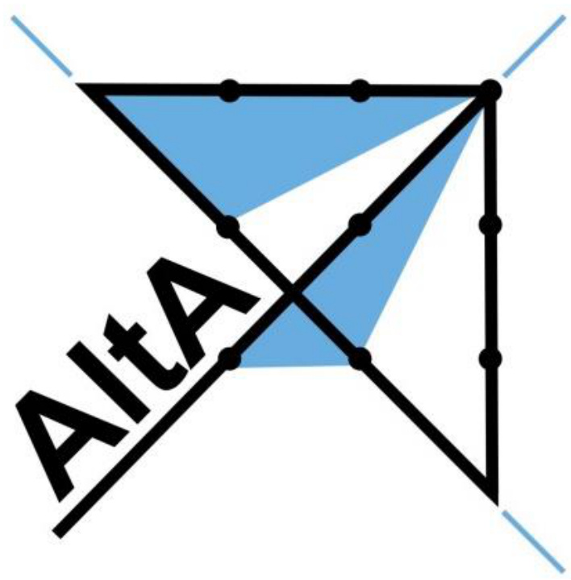  

This page is intentionally left blank.  

# 1 Alternative Analysis Explained  

Alternative Analysis (AltA) is a capability described as follows:  

# AltA is the deliberate application of independent, critical thought and alternative perspective to improve decision-making.  

The key words in this description are independent, critical thought, and alternative perspective. First, independent refers to being free from influence or control by others in matters of belief or thinking. Second, critical thought – also known as critical thinking – is the intellectually disciplined process of conceptualizing, applying, analysing, synthesizing, and evaluating information. It is necessary for valid reasoning when drawing conclusions about goals, problems, assumptions, concepts, evidence, implications, and consequences. Finally, alternative perspective is the result of looking at a situation, problem, or fact through a different mindset, cultural frame, or value and belief structure.  

In other words, AltA is a capability to look at problems in a different way in order to make better-informed decisions. It aims to improve innovation and creativity and to broaden understanding within the staff. To this end, it provides a vehicle to better comprehend the scope of the problem for which staff officers are seeking solutions. Hence, AltA supports them in producing enhanced output in a more efficient manner than relying on unstructured staff meetings or processes. Nevertheless, AltA is intended to supplement rather than duplicate functions performed by staff officers.  

AltA comprises of a set of simple techniques that enrich existing processes. They have been taken from industry, intelligence, and academic best practices and are tried-andtested approaches for problem-solving and decision-making. Some techniques such as mind mapping or brainstorming will be familiar to many, others may be less so. The techniques have been specifically chosen as ones that are most useful for NATO.  

The AltA capability is aimed at the NATO staff officer; as such, no prior experience or analysis training is necessary. Having said that, experienced analysts will find the techniques a useful complement to their skill set, and the capability is available to non-NATO staff officers.  

The AltA capability consists of three main areas: (1) the techniques themselves, (2) education and training in the form of a training course at NATO School Oberammergau, and (3) a community of AltA faclitators. The latter share experiences on NATO’s Transformation Network (TRANSNET) portal under https://portal.transnet.act.nato.int/ Pages/home.aspx (register there for “Operational Analysis, Research and Assessment”).  

This page is intentionally left blank.  

# 2 Motivation for Using AltA  

# Common Problems of Decision-Making Processes  

AltA ultimately aims to overcome the various problems that staff can face during decision-making processes in international organizations. Commonly experienced problems and how AltA helps addressing them are as follows.  

Staff often face complicated tasks. In many instances, not only the answer to a question, but even the question itself and the context surrounding it may be uncertain. This is further aggravated by a lack of specific guidance. Moreover, many staff officers are on a short (three-year) tour of duty, which poses limitations on their ability to become subject-matter experts in the problem. To overcome these challenges, AltA offers techniques that can provide an initial starting point for a task, explore the issues, or generate motivating ideas to start tackling the problem.  

Proficient English speakers tend to dominate meetings. International staff consist of members from many different nations with differing language skills. Some staff take longer to process their thoughts into English and can be dominated by those who think and talk quickly without hesitation. AltA addresses this problem by employing techniques that give participants time to gather their thoughts or use visual records to help people remember what was said. Additionally, its methods encourage round-table contributions where everyone gets an opportunity to express their views as well as writing sessions where thoughts are put on paper in silence.  

Meetings can be unproductive. The pitfall of long, boring, badly structured, or indecisive meetings without a palpable result is all too common. When employed, the AltA techniques described in this handbook can help to provide structure to a meeting, and some of them also often save time. Likewise, they can produce a tangible, shared outcome that may serve as foundation for follow-up processes.  

Decision-making is influenced by biases. This is further explained in the section below.  

# Biases  

AltA techniques seek to combat biases. A bias is an inclination – either consciously realized or completely unknown to a person – to present or be pre-disposed towards a particular perspective. This is often accompanied by an intentional or unintentional refusal to reflect upon the possible merits of alternative points of view. Such cognitive biases are present in every individual. AltA techniques tackle them by highlighting and evaluating other perspectives, by focussing on the issue instead of the person expressing it, and by managing arguments in a constructive way.  

Biases may appear at group and/or organizational level, too. They can become prevalent in large organizations, especially when there is a high pressure to deliver output. Often it is easier just to agree rather than to upset existing group norms or to fight against established organizational procedures. Operations, working groups on exercises, or day-today office life can easily fall foul of such biases. This is particularly common when the same team has worked together for several months or much time and money has been invested in a project. While considering the permanency of social and cultural factors that exist in NATO, the application of AltA techniques present a useful and viable mitigation for common pitfalls due to biases in the decision-making process.  

Common cognitive biases are depicted in Table 1.  

<html><body><table><tr><td colspan="2"></td></tr><tr><td>Bias</td><td>Description</td></tr><tr><td>Perceptual biases</td><td>Expectations: You tend to perceive what you expect to perceive. pected phenomenon. Resistance: Perceptions resist change even in the face of new evi- dence. feres with accurate perception, even after more and better information</td></tr><tr><td>Biases in estimating probabilities</td><td>becomesavailable. can imagine an event or recall similar instances. response to new information or further analysis. Overconfidence: In translating feelings of certainty into a probability</td></tr><tr><td>Biases in evaluating evidence</td><td>estimate, people are often over confident, especially if they have con- siderable expertise. Consistency: Conclusions drawn from a small body of consistent da- lessconsistentdata. Missing information: It is difficult to judge well the potential impact of missing evidence even if the information gap is known.</td></tr><tr><td>Biases in perceiving causality</td><td>Rationality: Events are seen as part of an orderly, causal pattern. forobservedevents. Attribution:Behaviour of others is attributed to some fixed nature of the person or country while your own behaviour is attributed to the situation in which you find yourselves.</td></tr></table></body></html>  

# 3 AltA Capability Principles  

AltA is intended to be flexible and widely applicable. It builds on existing staff and analytical capabilities where they are available instead of introducing a new entity or staff structure. Generally speaking, AltA rests on eight principles:  

(1) AltA is a capability. It is a capability consisting of techniques, training and education, and personnel. This capability is adaptable to meet each organization’s unique needs. For example, a strategic command might organize an ad hoc team to analyse an issue of strategic importance to the Alliance. The operational level might establish a standing team to assist in operations planning and assessment. Other organizations meanwhile might desire staff-wide implementation of these analytical skills to support deeper understanding of the topics they examine.  

(2) AltA supports problem-solving. It is performed to support a problem owner with creative problem-solving resources rather than to provide a stand-alone solution to a problem. AltA enhances thinking and creativity with a set of practical and mostly easy-to-apply techniques.  

(3) AltA can support a wide range of problems at any level of staff. It has broad applicability, from supporting a single staff officer faced with a problem to the complex decisions encountered by a large staff organization. The AltA techniques have been drawn from national defence organizations, industry, and academia and have been widely used. Learning AltA techniques gives a lifelong career skill set.  

(4) AltA provides an independent perspective. To be of value to a decisionmaking process, AltA must be free to deliver impartial or “out-of-the-box” thought that is not constrained by traditional hierarchal structures or organizational pressures.  

(5) AltA depends on mutual understanding to realize its full benefits. Problem owners must be willing to accept that the AltA process might be controversial. Simultaneously, AltA must respect the supported/supporting nature of the relationship and be sensitive to the potential impact of its product.  

(6) AltA is best applied throughout a process. Its early engagement is ideal to present alternative perspectives and insights in order to better inform the supported process.  

(7) AltA benefits from formal direction and guidance. Leaders can help by creating an organizational culture that is willing to use AltA to challenge beliefs and perspectives. The intended use of AltA should be tailored to the organization’s needs without constraining independence and flexibility.  

(8) AltA complements existing functions within an organization. It is designed to complement and draw from other existing functions (e.g. operational analysis, operations planning), not to replace or duplicate them.  

This page is intentionally left blank.  

The AltA process consists of four broad phases: initiation, preparation, application, and termination. This chapter provides a step-by-step guide to the AltA process, which is depicted in Figure 1. It offers advice and highlights considerations for the successful application of AltA techniques.  

AltA is applicable to any task where it is believed to improve the outcome. For simple applications, e.g. where staff officers apply AltA alone at their desks, the process in Figure 1 can be done quickly. Conversely, its steps should always be followed carefully when conducting a formal AltA workshop with a group of people.  

# Initiation  

During this phase, the requirement for AltA is considered, the task better understood, and potential resources identified.  

AltA can be initiated in three ways:  

 a commander or superior directs the use of AltA in a mission or task; the problem owner (i.e. any member of staff) suggests the need for AltA;  an AltA facilitator (someone who is trained in AltA) or any other staff member recognizes the opportunity to apply AltA.  

During the initiation phase, it is worth spending time to ensure that the problem, issue, or task can be better defined through discussion with any key stakeholders. The initiation phase also includes a consideration of the resources required (e.g. time, people).  

# Preparation  

The preparation phase confirms and refines the problem, issue, or task in order to identify and agree on the AltA technique(s) to be applied. The result of the preparation phase may be a formal/informal statement of work to be undertaken, with the expected outcome stated and resources allocated.  

# What is the expected outcome?  

Some AltA techniques are more suited for particular objectives and outcomes of the task or problem at hand. The problem owner must decide what the expected outcome from the application of AltA is, which may include the following.  

Problem structured and defined. A wider view of a problem or a common understanding among a group or community about a problem is required. New material created and potential solutions identified. There may be a requirement to take a look at a problem or issue from a different perspective in order to create new material. There may be a requirement to invigorate new ideas where past ideas have failed, too. Or there may be a requirement to identify more than one option or solution to a problem.  

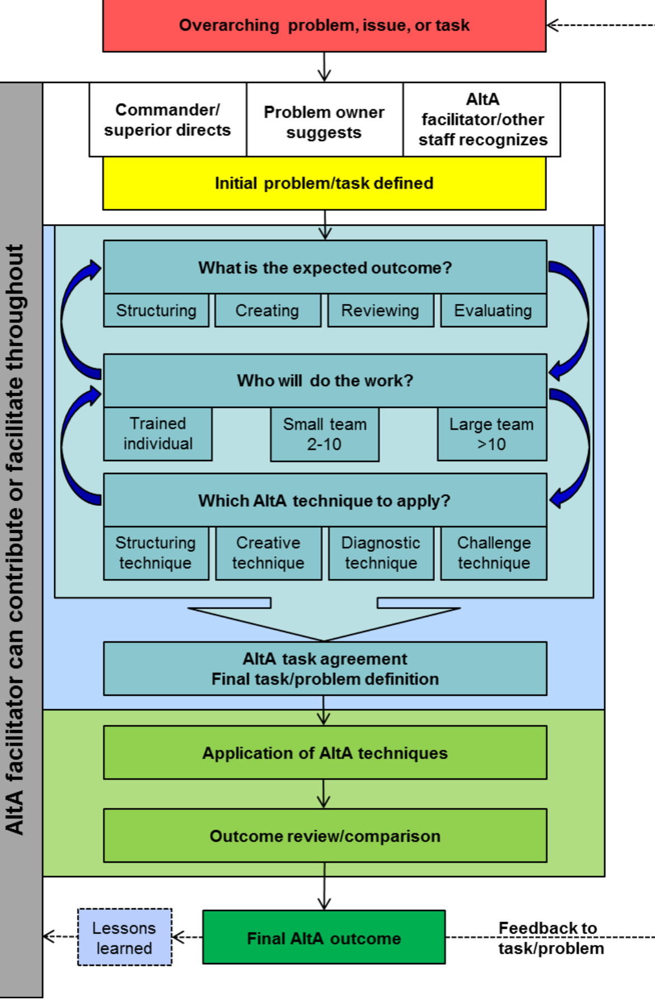  
Figure 1 – The four phases of the AltA process  

 Existing material reviewed. Material already developed may require fresh perspectives or assumptions; a plan or a proposed way ahead needs to be stressed and tested.  

Evaluation of options. When faced with different options – ensuring all options have been given equal consideration – a consensus may be required. There could also be a requirement to improve understanding of all possible future implications of a decision or chosen course of action.  

# Who will do the work?  

AltA can be applied in three ways, as shown in Figure 2. It can be applied by an individual working at their desk, informally in a team meeting, or at a formal workshop with the aid of an AltA facilitator.  

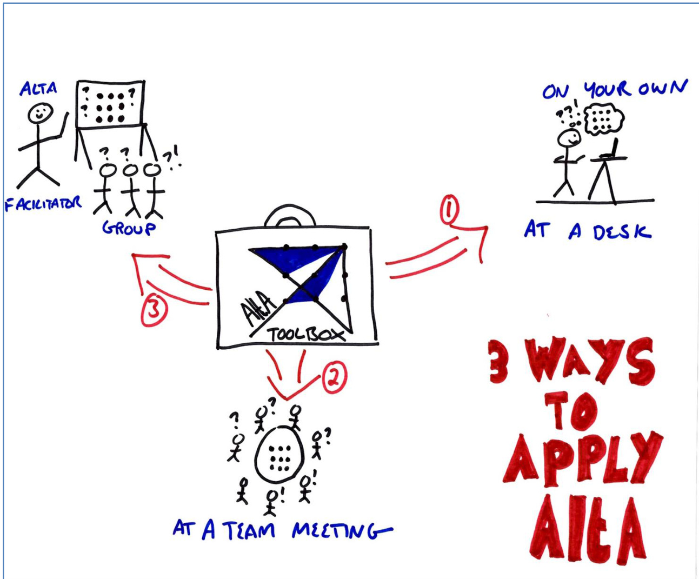  
Figure 2 – Three ways to apply AltA  

If AltA is to be applied in a team meeting or a workshop, there are some additional considerations.  

 Personnel requirements. While most AltA techniques are highly flexible and can be adapted to many situations and numbers of participants, some techniques work better in smaller groups. The table of techniques (at the beginning of Part 2 of this handbook) categorizes each one by whether they can be performed by an individual, a small group of two to ten people, or a larger group of more than ten.  

Typically, the greater the number of people participating, the greater the facilitation effort required.  

 Problem area subject-matter expertise. Participants in AltA do not always have to be experts in the problem area, although some domain knowledge can be helpful and is sometimes required. Too little subject knowledge among participants means that critical issues could be missed. Conversely, a group composed of subject-matter experts may not be able to see the problem from a fresh perspective. If the AltA facilitator has deep knowledge of the problem area, there is a danger they will impose their views and bias the group. Therefore, using an independent AltA facilitator is often helpful.  

# Which AltA technique to apply?  

The appropriate choice of technique depends on the particular problem to be solved and the expected outcome. Part 2 of this handbook provides a detailed step-by-step guide for each technique, including worked examples of the techniques in action. Experienced AltA facilitators will additionally develop skills to combine and sequence techniques.  

Choosing a technique is often the most important step in the AltA process. Different techniques are better suited to certain expected outcomes of AltA, whether that is structuring a problem, creating new ideas, or making a decision.  

Practical concerns for choosing a technique include the following.  

AltA experience. Some techniques such as mind mapping or starbursting can be performed with very little experience, whereas specialized techniques such as alternative futures analysis require more training and experience. In practice, all AltA techniques are designed to be used with minimal training. However, an inexperienced AltA facilitator may wish to start with an easier technique before moving onto the more difficult ones. As an aid, the table of techniques on page 18 categorizes them by their ease of application.  

Time required. Part of the ease of application depends on the amount of time the techniques require when applied and the amount of time available. These times vary based on the size of the group conducting the analysis, the problem’s complexity, the technique’s difficulty, and the thoroughness of the work. With practice, most of the techniques can be effectively conducted within an hour, yet some are much quicker if less time is available. The AltA facilitator must judge how much time to set for a technique.  

Facilities available. Some techniques can be done on paper or a small flip chart, but others require large whiteboards and lots of space to write down results, which are not always at hand. See Part 3 for more practical information concerning facilitation and facilities.  

# Ten Questions and Five Ps of AltA Preparation  

Here are ten questions that can help with the preparation phase of AltA. By answering them, a clearer picture of what is required will emerge.  

1) What is the overall topic under discussion?   
2) What questions are you trying to answer?   
3) Are you doing one of the following:  

structuring or defining a problem;   
creating new ideas (e.g. innovative solutions);   
reviewing a document;   
evaluating different options;   
something else?   
4) What are you trying to achieve from the application of AltA? What would an ideal outcome look like?   
5) How will the outcome of the AltA session be used?   
6) What related work has been done so far?   
7) How many people do you expect to be involved? Will AltA be applied in a workshop setting, a team meeting, or by an individual?   
8) Will the likely participants in the AltA session be experienced in the subject being discussed? Is experience necessary?   
9) How much time have you allocated for the AltA process?   
10) Do you have any concerns (e.g. strong personalities in a workshop, preexisting views, limited time)?  

Once these questions (and others) have been answered, the AltA facilitator can prepare for the AltA session using $5~{\mathsf{P}}\mathsf{s}^{2}$ .  

 Purpose: What is the purpose of the AltA meeting?   
 Product: What will be produced at the end of the meeting?   
· Participants: Who should be invited to participate?   
 Probable issues: What probable issues are likely to occur?   
 Process: Which AltA technique will be used? What are the exact steps required?  

# Output of preparation phase  

The output of the preparation phase is a clear idea for how AltA will be applied. This may be written down in an AltA task agreement. The agreement identifies the parameters for the AltA process to ensure it is clear to all involved during the application phase. Examples of what should be included in the agreement are:  

problem/task statement;   
who is leading the application of AltA;   
staff resources to be used;   
additional physical resources required;   
AltA technique or series of AltA techniques to be applied;   
timelines;   
expected outcome.  

# Application  

During this phase, the chosen AltA techniques are applied to the defined problem in order to achieve the desired outcome. The number of employed techniques is only limited by time constraints, limitations in subject-matter expertise, and the participants’ willingness to continue the process. These techniques can range from creative thinking techniques at the beginning to diagnostic techniques at the end. Applying different AltA techniques is often necessary to fully explore a subject.  

The application phase should ultimately result in a satisfied set of stakeholders. They should feel that either a solution has been reached or that they have more useful information now on which to base a decision.  

# Termination  

The process ends when the selected techniques have been executed, the findings written up and presented back to the problem owner, and it appears that the AltA process can add no further value.  

Depending on the complexity of the task, the AltA process may identify additional requirements for analysis instead of providing a solution or outcome. In this case, these requirements feed back into the initiation phase of the AltA process.  

Feedback resulting from the AltA session, including lessons learned, should be shared with the AltA community to establish best practice.  

# Part 2 AltA Techniques  

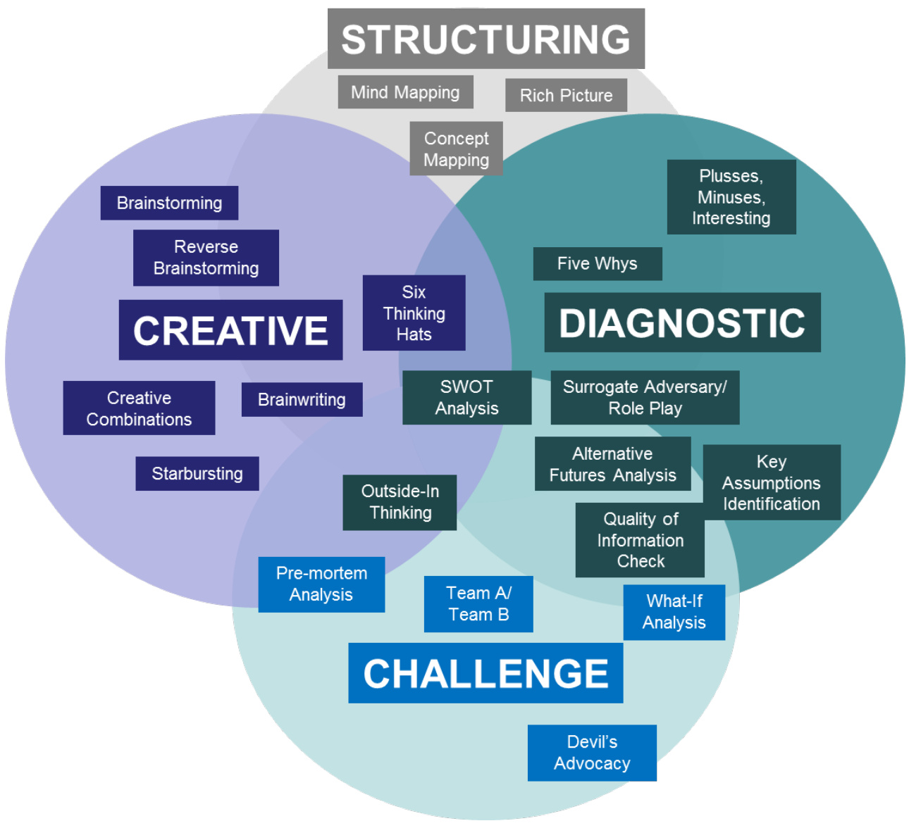  

This page is intentionally left blank.  

This handbook describes a total of 21 techniques, all of which belong into one or more of the following categories:  

(1) Structuring techniques. These methods identify and organize facts, problems, and ideas. Specifically, they break down a subject into its component parts by decomposing, visualizing, organizing, and grouping them. In general, structuring techniques are useful to capture complicated ideas, to share them with others, and to act as a framework for follow-on work.   
(2) Creative techniques. Creative thinking is the ability to see problems or situations from a fresh perspective and to break out of your frame of reference. Thus, creative techniques increase the number of conceived ideas, and they allow new and imaginative thoughts or novel combinations of them to be generated, too. Additionally, they facilitate innovation, enable group synergy (use the group to create something greater than the sum of the parts), and overcome biases and fixed thinking.   
(3) Diagnostic techniques. They support problem analysis or the development of alternative perspectives by testing hypotheses, examining lines of reasoning, assessing evidence, and evaluating multiple courses of action. These techniques are often used to identify or diagnose potential problems.   
(4) Challenge techniques. These methods also go by the names contrarian or competitive and come in three different types: self-critique, critique of others, and critique by others. They challenge current thinking and critique existing mental models, beliefs, or conventions by looking at the problem from a different, often opposing, view. As a result, they broaden the range of explanations considered, expose flaws in reasoning, or generate new ideas.  

Table 2 lists all the techniques explained in this handbook. It also contains a simple guide to their expected outcomes and their ease of application. Each technique is then described in further detail.  

Table 2 – AltA techniques and application   

<html><body><table><tr><td>AltA technique</td><td colspan="3">Outcome of applica- tion</td><td colspan="3">Number of partici- pants</td><td colspan="3">Ease of applica- tion</td></tr><tr><td></td><td>Structuring</td><td colspan="3">Reviewing Creating </td><td>Individual</td><td>people 10</td><td> people</td><td>Easy Medium</td><td></td></tr><tr><td></td><td>S</td><td></td><td>R</td><td>Evaluating </td><td></td><td>7. 2</td><td>10 A</td><td>Hard</td><td></td></tr><tr><td colspan="10">Structuring techniques</td></tr><tr><td>Mind mapping</td><td></td><td></td><td></td><td></td><td></td><td></td><td></td><td></td><td></td></tr><tr><td>Concept mapping</td><td></td><td></td><td></td><td></td><td></td><td></td><td></td><td></td><td></td></tr><tr><td>Rich pictures</td><td></td><td></td><td></td><td></td><td></td><td></td><td></td><td></td><td></td></tr><tr><td colspan="10">Creative techniques</td></tr><tr><td>Brainstorming</td><td></td><td></td><td></td><td></td><td></td><td></td><td></td><td></td><td></td></tr><tr><td>Reverse brainstorming Brainwriting</td><td></td><td></td><td></td><td></td><td></td><td></td><td></td><td></td><td></td></tr><tr><td>Starbursting</td><td></td><td></td><td></td><td></td><td></td><td></td><td></td><td></td><td></td></tr><tr><td>Six thinking hats</td><td></td><td></td><td></td><td></td><td></td><td></td><td></td><td></td><td></td></tr><tr><td>Creative combinations</td><td></td><td></td><td></td><td></td><td></td><td></td><td></td><td></td><td></td></tr><tr><td colspan="10">Diagnostic techniques</td></tr><tr><td>SWOT Plusses, minuses,</td><td></td><td></td><td></td><td></td><td></td><td></td><td></td><td></td><td></td></tr><tr><td>interesting</td><td></td><td></td><td></td><td></td><td></td><td></td><td></td><td></td><td></td></tr><tr><td>Five whys Key assumptions</td><td></td><td></td><td></td><td></td><td></td><td></td><td></td><td></td><td></td></tr><tr><td>identification Quality of information</td><td></td><td></td><td></td><td></td><td></td><td></td><td></td><td></td><td></td></tr><tr><td>check</td><td></td><td></td><td></td><td></td><td></td><td></td><td></td><td></td><td></td></tr><tr><td>Outside-in thinking Surrogate adver-</td><td></td><td></td><td></td><td></td><td></td><td></td><td></td><td></td><td></td></tr><tr><td>sary/role play Alternative futures</td><td></td><td></td><td></td><td></td><td></td><td></td><td></td><td></td><td></td></tr><tr><td>Challenge techniques</td><td></td><td></td><td></td><td></td><td></td><td></td><td></td><td></td><td></td></tr><tr><td colspan="10">Devil's advocacy</td></tr><tr><td>Team A/team B</td><td></td><td></td><td></td><td></td><td></td><td></td><td></td><td></td><td></td></tr><tr><td></td><td></td><td></td><td></td><td></td><td></td><td></td><td></td><td></td><td></td></tr><tr><td>Pre-mortem analysis</td><td></td><td></td><td></td><td></td><td></td><td></td><td></td><td></td><td></td></tr><tr><td>What-if analysis</td><td></td><td></td><td></td><td></td><td></td><td></td><td></td><td></td><td></td></tr></table></body></html>  

# 2 Structuring Techniques  

# Mind Mapping  

(for individual or 2–10 people; easy)  

A technique that visually organizes information around a central topic, hence creating a mind map. Such maps consist of a sole concept centred on a page with associated themes, such as images or words, linked to it. These links are commonly established using some structure or organizing scheme. Mind maps therefore literally “map out” ideas by forming relations between them. You can draw them either by hand or using software.  

# What to use it for  

organizing or structuring thoughts capturing a complicated notion in one page exploring new ideas about a topic creating exhaustive checklists for planning  

# Application  

Step 1: Write down key concept. Begin in the centre of a blank piece of paper, whiteboard or computer screen and represent the key concept there with a simple word or image. By starting in the middle, your brain has the freedom to spread out in all directions and to express itself more freely.  

Step 2: Identify subthemes and draw relationships. Find subthemes to radiate from the central word or image; these are the branches. Use only one or two words to capture your subtheme onto a branch. Now connect them to the central image. In addition, make your branches curved rather than straight lined. (Straight lines and boxes are boring and the opposite of creative!)  

Step 3: Break down subthemes even further. Split the main branches down into firstand second-level subthemes radiating from them; these are called twigs.  

# Example  

Example 1: Planning a Project  

Figure 3 depicts a mind map that a working group at HQ SACT created during a preliminary brainstorming session. Afterwards, they used it to develop a checklist for planning their project.  

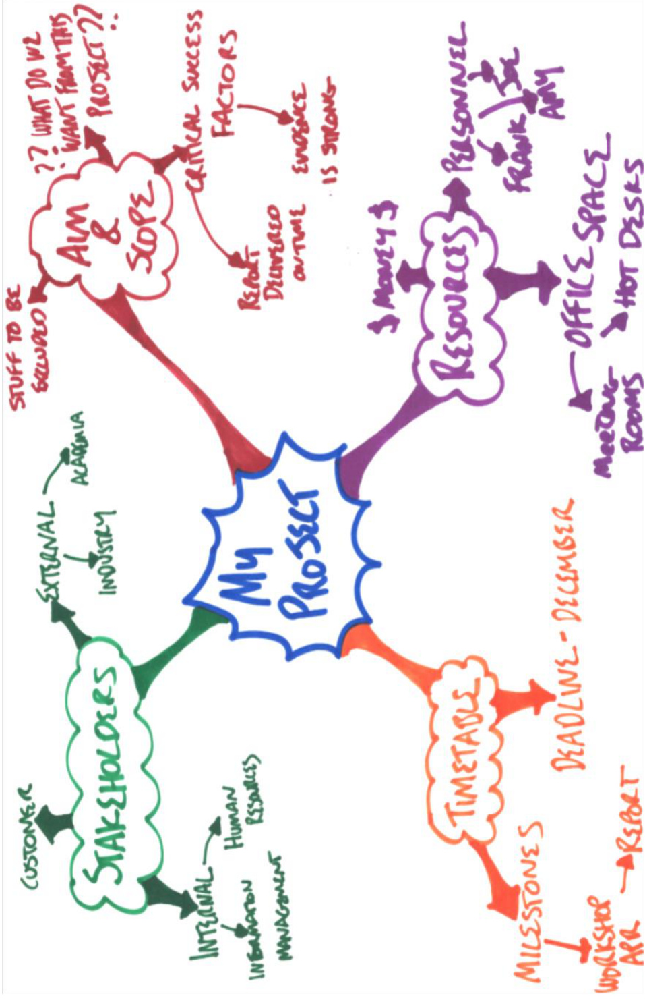  
Figure 3 – Mind map for planning a project  

Example 2: Summarizing a Document  

The example in Figure 4, on the other hand, shows a complicated document3 expressed as a mind map. It effectively presents an overview of its contents.  

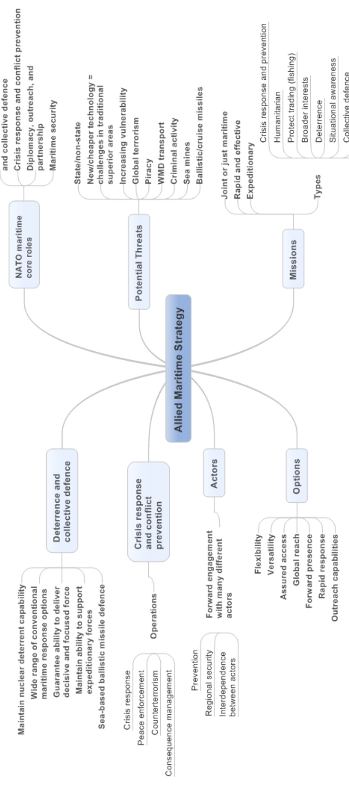  
Figure 4 – Mind map summarizing a document  

# Benefits  

Mind maps:  

are good for note-making and exploring ideas, because their flexibility helps you to think holistically and to visualize your reasoning.   
are a useful tool to rapidly understand interrelationships between different aspects of a problem or a situation. They accomplish this by focusing on meaning rather than worrying about grammar and semantics.   
allow you to capture thoughts at your desk or to take notes in meetings.  

# Challenges  

Mind maps:  

 are hierarchical tree structures. This may constrain thinking in highly interconnected or ambiguous situations where discrete branches are hard to identify. In such cases, other techniques like concept maps (see page 24) may be more appropriate. may be difficult for other people to understand once you have created and personalized them.  

# Hints and tips  

Use mind maps after a brainstorming session (see page 31) to capture and organize the results. They can likewise be applied during or after a workshop. Apply different colours when creating your mind map.   
 Include pictures or drawings along with words for quick visual association and idea retention.   
 Summarize large documents like books or journal papers with mind maps, thus making the information they contain usable and accessible. You can similarly apply them to ensure a produced text covers all the main points that were originally planned.  

Employ one of the many software tools available. Examples include:  

o Mindjet MindManager4 (on NATO’s approved fielded product list) o SimpleApps SimpleMind5 (inexpensive mind mapping tool) o FreeMind6 (free mind mapping application) o TOPFAS7 (has inbuilt mind mapping functionality)  

 Search on the Internet for “mind maps” to obtain many different examples.  

# Further reading  

 Buzan T, Griffiths C, Harrison J. Modern mind mapping for smarter thinking. Cardiff (UK): Proactive Press; 2013. http://www.mindmapping.com/ Website about mind mapping. http://mindmappingsoftwareblog.com/ Blog about mind mapping software.  

# Concept Mapping  

(for individual or 2–10 people; easy)  

A technique that produces a diagram depicting suggested relationships between concepts. Concept maps represent ideas and information – that is, concepts – as boxes or circles which are connected by labelled arrows. You can draw them either by hand or using software. This technique allows multiple hubs and clusters; hence, it is a more free form than mind mapping (see page 19), which centres on a single concept.  

# What to use it for  

 stimulating the generation of ideas framing subjects or problems understanding dependencies and linkages between concepts communicating complex ideas and arguments in a visual manner  

# Application  

Step 1: Construct focus issue. Develop a statement or question that clearly specifies the problem the concept map is trying to resolve or analyse. A good focus issue assists in developing a richer concept map.  

Step 2: Identify concepts applying to the focus issue. Write down the key concepts that relate to the focus issue; usually 15 to 25 concepts will suffice. One option is to write each concept on a sticky note for easy placement.  

Step 3: Construct preliminary map. If you used sticky notes in the last step, start by clustering concepts together, then link them with arrows. If not, simply draw the concepts and their relationships, represented by arrows, on a blank piece of paper, whiteboard, or computer screen.  

Step 4: Revise preliminary map. After the preliminary map has been constructed, try to add and delete concepts in order to revise the thinking. Seek out cross links, too; these are arrows drawn between concepts that belong to different clusters. After that, label these lines with descriptive words. But since all concepts are likely related to one another in some way, it is necessary to be selective when looking for cross links. Moreover, be as precise as possible in identifying linking words.  

Step 5: Interpret and use map. Step back from developing the concept map and interpret it. For this purpose, identify the key concepts of importance, e.g. ones with a lot of links. Next ask yourself the following questions: Are these the concepts that were expected to be of most importance? Are there any surprising concepts that have evolved from the map development? Are there any new questions that have been derived from the process of concept mapping? Finally, you can use the concept map to carry a message or to tell a story for use in other AltA techniques.  

# Example  

The concept map in Figure 5 provides an overview of key factors that characterize an individual’s psychology.  

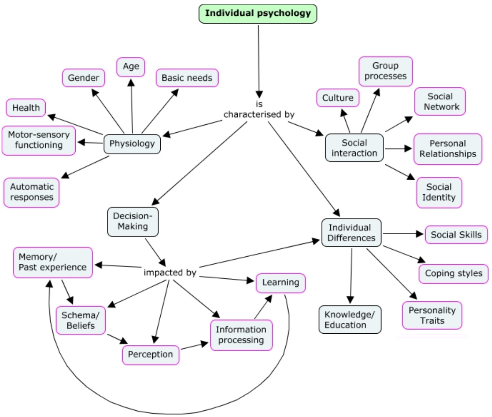  
Figure 5 – Concept map on individual psychology  

# Benefits  

Concept mapping:  

allows your group to collectively develop an understanding about the problem area and its conceptual relationships.  

encourages high levels of cognitive performance. This is because identifying and describing cross links forces in-depth thinking about a subject or problem and requires evaluation and synthesis of knowledge.  

# Challenges  

Concept mapping:  

necessitates high levels of cognitive performance. may require substantial amounts of factual information about the focus issue for certain applications. (If these are not available, links based on assumptions should be recorded.)  

# Hints and tips  

 Remember that the value of concept mapping often comes from the process of constructing the map and not necessarily from the final outcome. Avoid writing full sentences into the boxes or circles, but use only one or two words instead. Continually revise the concept map by repositioning concepts in ways that lend to clarity and better overall structure until you have finalized the map.   
 Use software tools to aid you in creating and revising concept maps. Examples include:  

o Microsoft PowerPoint9 o Microsoft Visio10 (on NATO’s approved fielded product list) o IHMC Cmap11 (free concept mapping tool; also available as web application)  

# Further reading  

 Novak JD, Cañas AJ. The theory underlying concept maps and how to construct them. Pensacola (FL): Florida Institute for Human and Machine Cognition; 2008. (Technical report IHMC CmapTools 2006-01 Rev 01-2008). http://www.schrockguide.net/concept-mapping.html Web directory about concept mapping.  

# Rich Pictures  

(for individual or 2–10 people; medium)  

A technique that helps explore, acknowledge, and define a situation or an idea by expressing it through graphical means, thus creating a “mental model”. Rich pictures may consist of diagrams, symbols, cartoons, and words, and you can draw them either by hand or electronically. Nevertheless, they are neither flow diagrams nor logic models, but rather reflections of a current situation or idea. This technique bears similarities to concept mapping, but differs in that it primarily employs pictures instead of words to represent concepts.  

# What to use it for  

 managing and understanding an apparently complicated situation or idea opening a discussion drawing an ongoing conversation or interview in real time  

# Application  

Step 1: Choose canvas and materials. Rich pictures work best on whiteboards, where you can quickly revise them, or by using pencil and paper. Consider the amount of space you have, and keep a variety of coloured pens at hand.  

Step 2: Identify entities involved and draw them. Take into account all the main entities such as critical stakeholders, organizations, or equipment. Then use cartoons, quick sketches, or diagrams to represent these entities. To do this, you do not need any artistic talent.  

Step 3: Describe links between entities. Think about the relationships between the entities and draw them out. Afterwards describe each link with a few words, or draw a diagram or cartoon instead that explains the connection in a simple way.  

Step 4: Return to step 2 and then review. Repeat the preceding two steps by adding more entities and relationships as they come up in the discussion. Once the picture is complete, use it as a basis for discussion and reflection.  

# Example  

Figure 6 is an instance of a rich picture that shows the situation for education of and awareness on Alternative Analysis for staff at HQ SACT. It could be used to explain what areas need improving or reinforcing and to quickly visualize how change might affect the situation.  

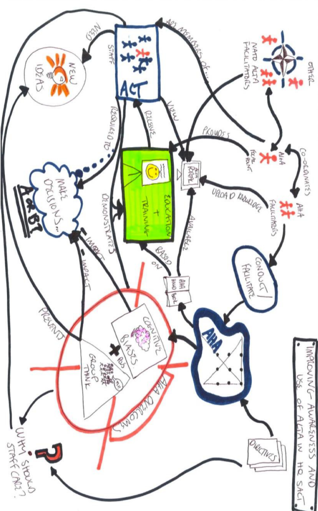  
Figure 6 – Rich picture on improving awareness and use of AltA in HQ SACT  

# Benefits  

Rich pictures:  

uses graphics and symbols, which are more easily understood and better remembered than plain text. encapsulates the issues surrounding an intricate situation through a full visual representation. helps to come to a shared understanding of a situation when you have seemingly different points of view. And while it does not tell you what to change or how to improve a situation, this may come up in the discussion when drawing the picture.   
 is an unconstrained and very flexible technique with few rules or structural constraints that can be performed very quickly.  

# Challenges  

Rich pictures:  

makes it difficult to encompass abstract concepts, since they cannot always be easily represented by graphical means.   
can cause you to get bogged down in drawing minute detail in the pictures. This frustrates the purpose of finding quick ways to pictorially represent entities and reduces the chance to create spontaneity and develop creative ideas.  

# Hints and tips  

 Remember that the value of rich pictures often comes from the process of drawing them and not necessarily from the final outcome. Start by drawing a rough sketch to help layout the content of your rich picture. Do not try to complete it straight away.   
 Make certain the paper is always visible to all members of the group. Try to be creative and use your imagination to pencil diagrams and cartoons of your entities. This forces the brain to think within its more creative side, and consequently it can better formulate new ideas for the situation being drawn. Use different coloured pens and limit writing or commentary, because this can be distracting.   
 Ensure the picture includes not just factual data, but subjective opinions, too.  

# Further reading  

Roam D. The back of the napkin: solving problems and selling ideas with pictures. Expand. ed. New York: Portfolio; 2013. Sibbet D. Visual meetings: how graphics, sticky notes and idea mapping can transform group productivity. Hoboken (NJ): John Wiley & Sons; c2010.  

 Checkland P. Soft systems methodology: a thirty year retrospective. Systems Research and Behavioral Science. 2000 Nov 15; 17 Suppl 1:S11–58. Theoretical foundation of rich pictures. https://www.betterevaluation.org/evaluation-options/richpictures Website about rich pictures. https://www.youtube.com/watch?v=0YvXlHy_B0Y Example video of a rich picture being drawn.  

# 3 Creative Techniques  

# Brainstorming  

(for individual or 2–10 people; easy)  

A technique that harnesses creative perspectives, thereby generating new ideas about a subject or new solutions to a problem. Since this unconstrained group process underpins most of the other AltA techniques, you will use it often and in conjunction with them.  

# What to use it for  

handling projects in an early stage   
managing uncertain or ambiguous situations   
getting out of a dead end   
stimulating new thinking and ideas about a subject or problem  

# Application  

Step 1: Define initial question(s). Take your time to develop a good question to generate ideas about, because asking the right one is the key to effective brainstorming. As a result, you may find that there is more than one question and that you consequently need more than one brainstorming session.  

Step 2: Set up brainstorming session. Start the meeting by telling the participants the purpose of the activity, and write the main question on a whiteboard or flip chart. Next, set the ground rules for the session, the most important typically being “no initial criticism of ideas”. Encourage crazy and impractical thoughts at first, because they may spark a more reasonable one later on. Conversely, initial judgement of them may inhibit the thinking process. After all, unconventional thoughts can contain the seeds of an important connection between the topic and an unstated assumption. Other useful ground rules include “one idea per sticky note” and “write legibly so others can read it”.  

Step 3: Divergent phase. Motivate the participants to generate as many ideas as possible during this phase without initially judging their quality or practical implications. There are two ways of doing this: One is to distribute pens and sticky notes to each participant, and get them to write their ideas down. As they stick them on the board, they call out their idea for others to hear. This option usually generates the higher number of ideas, but often the sticky notes are hard to read afterwards. The second option is to have participants call out ideas, and the AltA facilitator writes them down and places them on the board. This gives more control over ideas (e.g. the AltA facilitator can rewrite statements with agreement of the group into something legible), but takes more time.  

When a pause follows the initial flow of ideas, the group has reached the end of their conventional thinking. At this point, new and divergent thoughts are likely to emerge, so invite the participants to review the ideas already on the board. But do not move on too quickly, because sometimes people need pauses to reflect and to start thinking outside the box.  

End the divergent phase of the brainstorming session after two or three pauses; a large number of written sticky notes should now be present. This may be a good time to encourage a discussion about particular ideas of interest.  

Step 4: Convergent phase. Categorize, organize, and prioritize your ideas in this phase to produce an appropriate product.  

Categorize and organize: First, rearrange the ideas on the sticky notes into categories. The participants can do this either by themselves – maybe in silence – or delegate the task to the AltA facilitator. Next, choose a simple word or phrase to describe each category. If the problem owner wants just a quantity of ideas, the brainstorming session can end at this point. Often, however, the problem owner instead wants to receive a few important ideas to work on further; this you can achieve through prioritization. Prioritize: The simplest way of prioritizing is to ask the group which ideas they view as having high priority. Another easy voting method consists of distributing a small number of sticky dots to each participant. Then you request them to stick the dots on the ideas they think are most important. A third option is to let the group rate each idea as being of high, medium, or low importance. Of course, the most suitable technique depends on the nature of the group, the time available, and the number of ideas generated. Nevertheless, ensure that all participants use the same criterion for prioritization by agreeing on it beforehand. For example, vote for the idea that is most likely to succeed or the most innovative one.  

Step 5: End brainstorming session. Summarize what finally has been achieved and what you will do with the generated ideas.  

# Example  

A workshop tasked with creating information for a strategic foresight analysis report12 applied brainstorming in order to identify new strategic trends for further examination.  

Step 1: Define initial question(s). The AltA facilitator began by preparing the following question to brainstorm: “What strategic trends may the Alliance face in the decades to come?” They also ensured a large whiteboard, sticky notes, and pens were available.  

Step 2: Set up brainstorming session. Thereafter, the AltA facilitator started the meeting by introducing the question of finding new strategic trends to the assembled group and setting the ground rules.  

Step 3: Divergent phase. The AltA facilitator then asked each participant to write down ideas for new trends in their notebooks for five minutes in silence. After the time was up, the AltA facilitator asked each participant for an idea, wrote them on sticky notes, and placed them on the board. When an idea was not obvious, the AltA facilitator did not judge the statement but did ask questions for clarification purposes. Refer to  

Figure 7 for part of this output.  

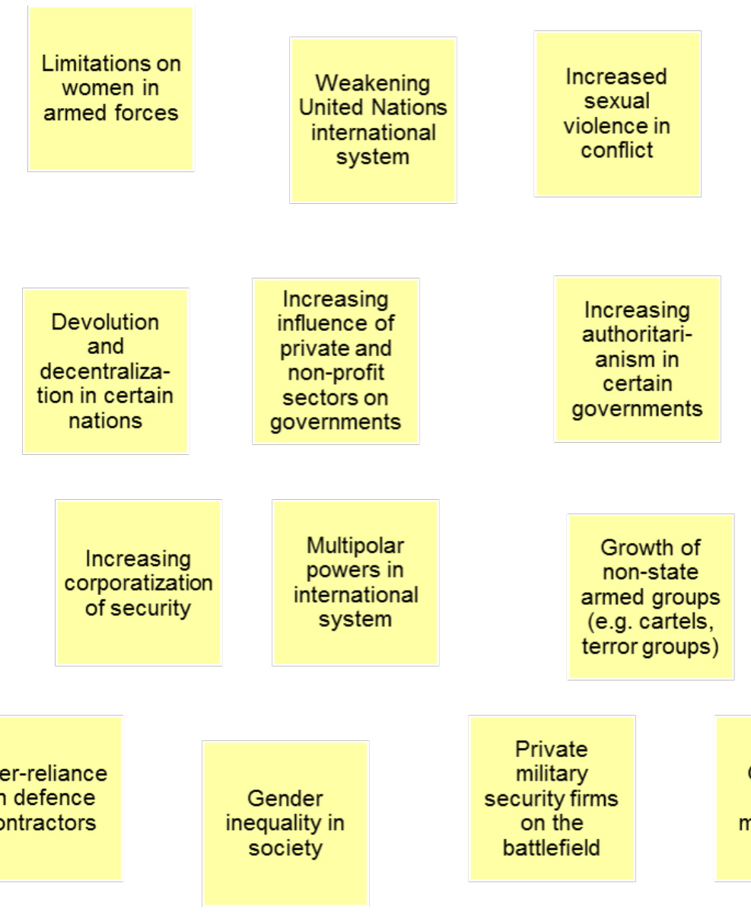  
Figure 7 – Examples of ideas generated during divergent phase  

Step 4: Convergent phase. Next, the group moved on to categorize, organize, and prioritize the generated ideas.  

Categorize and organize: First, the AltA facilitator clustered similar ideas together to form categories. Then the group reviewed and discussed each new strategic trend, sometimes changing the words on the sticky notes in order to clarify them. Figure 8 depicts these categories and the corresponding ideas. Some thoughts did not entirely fit into a specific category; the participants consequently grouped these as linked orphans.  

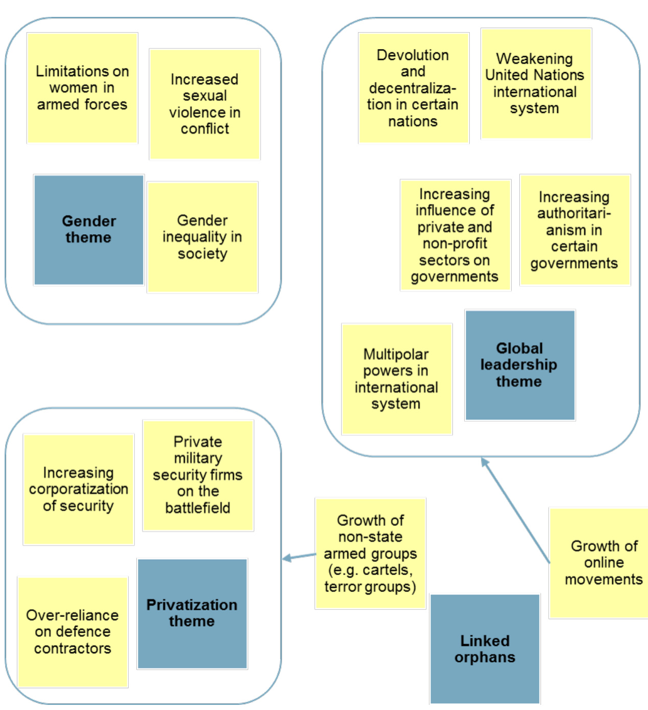  
Figure 8 – Example of categorized and organized ideas  

Prioritize: Second, the group voted on the most important categories. For this purpose, the AltA facilitator handed out three sticky dots to each participant which they allocated to categories of ideas. Then the categories were prioritized into high, medium, or low priority, depending on their number of dots and the resulting discussion. This allowed the better categories of strategic trends to rise to the top, as Figure 9 shows.  

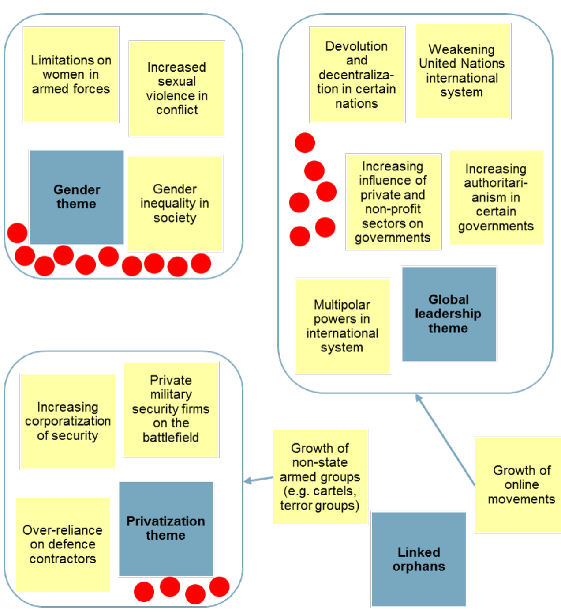  
Figure 9 – Prioritized ideas  

Step 5: End brainstorming session. Finally, the team recommended that certain highpriority strategic trends be put forward for consideration into NATO’s Strategic Foresight Analysis project.  

# Benefits  

Brainstorming:  

maximizes creativity, comprehensive thinking, and knowledge sharing, thus ensuring that you consider a wider range of factors and ideas.  prevents premature consensus around a single solution. produces a large number of ideas that you can research further.  

creates cohesive teams and inspires collaboration by making sure that everyone, regardless of background or expertise, participates.   
requires only limited time and very little preparation if the group is already in place and the question is clear.  

# Challenges  

Brainstorming:  

may be constrained by the participants’ knowledge about the topic and their ability to generate ideas.   
compels participants to defer judgement on initial ideas and to encourage out-of-thebox thinking.  

# Hints and tips  

 Consider selecting a structure for the brainstorming when you face more complex topics. For example, use the $\mathsf{P M}^{13}$ framework (see page 64) to brainstorm the subject; you will then generate ideas within this structure in step 3. Alternatively, employ a framework such as PMESII14 to encourage comprehensive thinking.  

 Combine brainstorming with other AltA techniques to get the most out of a session. Employ pens and sticky notes of the same colour for everybody, especially if anonymity is important. Impose silence for five minutes whilst participants write down ideas in order to stop one or two strong individuals from dominating the group. Conduct a brainstorming session online if you do not have the facilities or opportunities for a face-to-face gathering. For instance, use the infrastructure provided by an Internet forum or ACT’s Innovation Hub15.  

# Further reading  

 Development, Concepts and Doctrine Centre. Red teaming guide. 2nd ed. Shrivenham (UK): Ministry of Defence; 2013 Jan.   
 https://www.mindtools.com/brainstm.html Web page about brainstorming.   
 http://blog.ted.com/how-to-run-a-brainstorm-for-introverts-and-extroverts-too/ Blog entry about brainstorming.  

# Reverse Brainstorming  

(for individual or 2–10 people; medium)  

A technique that explores problems by combining brainstorming with reversal methods. It follows a similar process as regular brainstorming (see page 31), except that you pose the opposite question of the one you want to answer. So instead of “How do I solve this problem?”, you inquire “How do I cause this problem?” And rather than questioning “How do I achieve these results?”, you ask “How do I achieve the opposite effect?” Such an inverted question forces you to think in a different way, which is the basic idea behind reverse brainstorming.  

# What to use it for  

coping with problems that are difficult to address directly and whose solutions are not easy to see  generating new thoughts when other brainstorming methods are not working  creating radical or out-of-the-box ideas  

# Application  

Step 1: Define initial question(s). Take your time to develop a good question to generate ideas, because asking the right one is the key to effective brainstorming. As a result, you may find that there is more than one question and that you consequently need more than one brainstorming session.  

Step 2: Reverse initial question(s). Change the question you want to answer such that it asks the exact opposite. Often, it is enough to replace the main verb of the question by its antonym.  

Step 3: Conduct brainstorming. Find solutions to the reversed question through brainstorming. To do this, follow steps 2–4 of the application of brainstorming on page 31f.  

Step 4: Reverse solutions. Take the generated solutions and reverse them again to get answers to your initial question.  

# Examples  

During a workshop on protection of civilians, the participants looked for ways in which the Alliance could protect humanitarian actors during an operation. Reverse brainstorming was chosen to highlight unintentional negative effects of NATO actions.  

Step 1: Define initial question(s). The workshop participants wanted to answer the following question: “What can NATO do to protect humanitarian actors?”  

Step 2: Reverse initial question(s). Next, the AltA facilitator reversed that question. It now read: “What can NATO do to harm humanitarian actors unintentionally16?”  

Step 3: Conduct brainstorming. In the following step, the group brainstormed ideas to answer this question. At first, there was initial resistance to the question with statements such as “Of course NATO does not go out of its way to harm humanitarian actors”. Interestingly, the follow-on statement was along the lines of “Well, we don’t mean to harm them, but there are many actions we take in good faith that end up doing just that”. The left column of Table 3 shows the results of the brainstorming.  

Step 4: Reverse solutions. Finally, the participants reversed the generated answers, which you can find in the right column of Table 3.  

Table 3 – Generated answers and their reversal   

<html><body><table><tr><td>Answersgenerated</td><td>Reversalofanswers</td></tr><tr><td>Military forces take on image of humanitarian actor.</td><td>Useof NATO military uniformsand other distin- guishing marks is important to delineate roles.</td></tr><tr><td>Militaryforcestakeonhumanitarianactivities (e.g. supplying food).</td><td>Concentrate on military mission in order to allow humanitarian actors to supply the basic needs.</td></tr><tr><td>Insufficient coordination with aid agencies.</td><td>Better coordination with aid agencies is required.</td></tr><tr><td>Blurring the linesbetween military and humanitar- ian activities in the population's perception.</td><td>Emphasize distinction between NATO and hu- manitarianactorstolocalcivilians.</td></tr><tr><td>Adopt a short-term military approach on opera- tions.</td><td>Adopt longer-term approach on operations and consider follow-on effects.</td></tr><tr><td>Convey over-promising, disconnected, or mixed Keep conveyed messages realistic and relevant. political messages.</td><td></td></tr></table></body></html>  

# Benefits  

Reverse brainstorming:  

generates more radical ideas by forcing participants to think the opposite of what they believe.  challenges the status quo of an existing process and gives a different perspective. allows participants to be critical and judgemental, which many people find easier than to generate positive ideas.  

# Challenges  

Reverse brainstorming:  

faces similar challenges as regular brainstorming (see page 36). requires a clear question or problem statement that can be reversed. needs to be carefully explained to the participants, because they may not understand why they are supposed to answer the opposite of their question.  

# Hints and tips  

Set up the initial question so it can be reversed as best as possible. Apply this technique when you want people to think differently or when discussion is stalling. Emphasize that the answers you generate for the reversed question are nothing you want to employ in reality.  

# Further reading  

https://www.mindtools.com/pages/article/newCT_96.htm Web page about reverse brainstorming.   
http://www.creatingminds.org/tools/reverse_brainstorming.htm Web page about reverse brainstorming.  

# Brainwriting  

(for 2–10 or more than 10 people; easy)  

A technique that is based on brainstorming and starts out with individual idea generation before exposing them to the group. In particular, each participant writes down ideas individually; after that, they are silently passed around so group members can draw on others’ thoughts. Similar to brainstorming, it is not the quality of ideas that matters at first but the quantity.  

# What to use it for  

working with many participants where splitting them into smaller groups would be too   
disruptive to the overall meeting   
managing sessions where only limited time is available  

# Application  

Phase A: Prepare session. Define a suitable question you wish to ask the group for ideas about.  

Phase B: Execute session.  

Step 1: Hand out paper. Give one sheet to each participant, and pose the question to the group. Next, ask for questions of clarification to ensure everybody has understood the problem.  

Step 2: Write down ideas. Ask each participant to silently write down ideas on their sheet of paper. No talking is permitted. Set a time limit of about three to five minutes for this step.  

Step 3: Pass paper on. Instruct everyone to stop writing after the time is up and to pass their paper to the person sitting next to them. Consequently, each participant receives a new paper with their neighbour’s ideas.  

Step 4: Add new ideas. Request the participants to silently review the ideas on the new paper they have just received. Then invite them to comment on and add to these thoughts, or to append more ideas to the list.  

Step 5: Return to step 3 (pass paper on). Repeat the preceding two steps four to five times or as often as you deem necessary. Ensure the papers are passed on in the same direction each time, so that participant do not receive their own ideas back again.  

Phase C: End session. Collect all sheets after they have been passed around a few times. Now, either generate a facilitated discussion by using the pieces of paper as stimulation or analyse their contents later at your desk.  

# Example  

Example 1: Improving Handover Process  

A team from NATO wanted to know how to improve the handover process, i.e. when a new military staff officer replaces another. This technique was used to quickly get ideas regarding the problems and solutions for handovers by taking advantage of a newcomer’s training event where 45 people were present.  

Phase A: Prepare session. The AltA facilitator prepared two main questions to answer: First, “What challenges did you face regarding the handover process?” and second, “How could NATO improve its handover process?”  

Phase B: Execute session.  

Step 1: Hand out paper. Each participant received a blank sheet of paper and was asked to write the two questions on the top of the paper side by side with a line down the middle.  

Step 2: Write down ideas. Then, the participants were given three minutes to write down their ideas on the paper in either column.  

Step 3: Pass paper on. Every two minutes thereafter, they passed the paper on to the person on their right.  

Step 4: Add new ideas. Next, the participants reviewed the new paper just received. After that, they either wrote down new problems on the left or suggested solutions on the right of the paper.  

Step 5: Return to step 3 (pass paper on). In total, the group conducted five iterations. Each person then had a piece of paper in front of them which looked something like Table 4.  

Table 4 – Example brainwriting sheet   

<html><body><table><tr><td>What challenges did you face regarding the handoverprocess?</td><td>How could NATO improve its handover pro- cess?</td></tr><tr><td>I arrived two weeks after my predecessor left.</td><td>Ensure there is at least a one-week overlap be- tween handovers.</td></tr><tr><td>I could not find any of the material my predeces- Make use of shared storage space for project- sor was working on.</td><td>related files.</td></tr><tr><td rowspan="2"></td><td>I spent days feeling “lost" in the HQ as I could not Create searchable floor plans withindividual there.</td></tr><tr><td>CreateopportunitiesforsocialclubssoIcanget toknowpeoplewhohavesimilarintereststome.</td></tr><tr><td>-sanb uew aun on anisuodsaun sm losuods tions I had.</td><td></td></tr></table></body></html>  

Phase C: End session. The AltA facilitator ended the session by generating a discussion on the handover process, asking the participants to use the notes on the paper to spark discussion points. Finally, the AltA facilitator gathered in all the pieces of paper for further analysis.  

Example 2: Generating Content for Policy Guidance  

As a second example, a workshop used brainwriting to generate ideas for the contents of a policy guidance for autonomous systems17.  

Phase A: Prepare session. For this purpose, the AltA facilitator designed three questions focused on the target audience of the policy guidance and the key messages it should contain. In particular, these questions were the following.  

Which specific offices or persons would benefit from reading the policy guidance? How would they use it?  What one policy or subject area needs to be influenced and why? What are your top three concerns, issues, findings, or messages that should be captured in the policy guidance? What, if anything, should be excluded from the policy guidance?  

The AltA facilitator asked participants to tackle one question at a time using a separate section of the brainwriting paper for each question.  

Phase B: Execute session.  

Step 1: Hand out paper. Each participant received a sheet of paper together with the present question.  

Step 2: Write down ideas. Then, the participants were given five minutes for the first and third and three minutes for the second question to put down their thoughts.  

Step 3: Pass paper on. Every three to five minutes, depending on the question in focus, the participants passed the paper on to the person on their right.  

Step 4: Add new ideas. In between, they either commented on or added to the ideas already written or augmented the list with new ideas of their own.  

Step 5: Return to step 3 (pass paper on). For each question, the group conducted three to four iterations. Afterwards, they moved on to the next question.  

Phase C: End session. After each question had been settled, the AltA facilitator collected the sheets. This way, the participants produced over a hundred pages of text in 45 minutes. Thereafter, the AltA facilitator analysed them overnight and reported a summary back to the group on the next day.  

# Benefits  

Brainwriting:  

generates oftentimes more ideas than a regular brainstorming session as they are created simultaneously. sparks new ideas in other people through sharing of thoughts. reduces the risk of groupthink or group biases since thoughts are produced individually.  brings out more extreme ideas because there is no risk of judgement or initial criticism. anonymizes input, which is useful when discussing a sensitive subject where the group has conflicting opinions about. allows quiet or shy people to contribute equally with loud, dominating, or opinionated one as it is largely conducted in silence. takes little time to complete, is easy to implement, and does not require an experienced AltA facilitator.  lends itself to any group size.  

# Challenges  

Brainwriting:  

generates a large number of ideas very quickly, which may hamper a subsequent discussion, analysis, or prioritization. . repeats ideas several times, as multiple individuals may have the same thought. limits the discussion, thereby raising the risk of participants not fully understanding a complex question. may face the problem of group members being unable to express their ideas in writing. allows participants to “accidentally” forget to hand over their papers to the AltA facilitator at the end if it contains ideas not to their liking.  

# Hints and tips  

 Employ a bell or a timer to signal the time to pass on the paper.   
 Collect all papers and hand them back out randomly after each round rather than asking people to pass theirs on to their neighbour. This way you ensure anonymity if it is important.   
 Use lined paper, paper with blank sticky notes stuck on it, idea forms, or online documents (e.g. on ACT’s Innovation Hub18) as a medium to take down ideas.  

Ask participants during the second or third round to provide action points or comments on the ideas captured in the first round.  

# Further reading  

Michalko M. Thinkertoys: a handbook of creative-thinking techniques. 2nd ed.   
Berkely (CA): Ten Speed Press; c1991–2006.   
http://www.managetrainlearn.com/page/brainwriting Web page about brainwriting.  

# Starbursting  

(for individual, 2–10, or more than 10 people; easy)  

A technique that focuses on generating questions to ask about a problem rather than producing ideas or solutions to it.  

# What to use it for  

generating a list of questions to be answered through project activities in the early stages of project planning   
pre-empting questions about any existing project or idea, i.e. pre-empting questions that may arise during a situational update brief to your senior officer   
creating a checklist to ensure all aspects of a project or a document have been covered comprehensively  

# Application  

Step 1: Draw star. Depict a star with six points on a whiteboard or flip chart. Then write “Who?”, “What?”, “Why?”, “When?”, “Where?”, and “How?” at each point. Enter a statement representing the topic of discussion in the middle of the star.  

Step 2: Generate questions. Go systematically through each of the six points and brainstorm possible questions around the topic starting with the corresponding interrogative word. After that, move on to the next point. Do not progress too quickly, as more outof-the-box questions usually come up only after you have asked all the obvious ones. Avoid also the common pitfall of answering the questions as they are generated.  

Step 3: Categorize, organize, and prioritize. Structure your questions once you are done generating them as you would with brainstorming (see step 4 on page 32).  

Step 4: Formulate action plan. Discuss or answer any question that you can easily or quickly address. Go through the remaining questions one at a time and develop an action plan for each. You will answer some of them straightforwardly through a quick research, e.g. by Internet search or by talking to the right expert. Other questions may take time to resolve, but you can use them to develop a project plan or a structure for your task.  

# Example  

A group used starbursting during the early stages of a project on Urbanization to generate questions about its implications for NATO.  

Step 1: Draw star. The AltA facilitator began the starburst by drawing the star on a whiteboard and stating the subject as in Figure 10.  

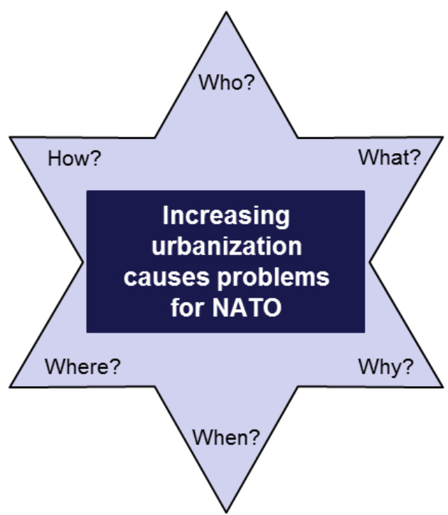  
Figure 10 – Drawn star  

Step 2: Generate questions. Then the participants generated questions one point at a time; this way, they came up with more than 150 questions during the session.  

Step 3: Categorize, organize, and prioritize. Afterwards, the group used sticky dots to prioritize the questions. Refer to Figure 11 for a small subset of them and how the participants judged their importance. The AltA facilitators additionally organized the questions into two main categories, namely “project management related” and “required research”.  

Step 4: Formulate action plan. As a final step, the AltA facilitator conducted an analysis of the findings after the workshop had finished. The group subsequently used the resulting conclusions as a guideline on how to further proceed with the project. Moreover, the generated questions made up the foundation for the ensuing literature review and the commission of research paper.  

# Benefits  

Starbursting:  

ensures comprehensive thinking about a wide range of factors affecting a project or problem.   
 provides useful structure for a brainstorming session.   
 is simple to use, since normally people find it easier to generate questions rather than answers. This is especially true at the beginning of a project. can be done by anyone, regardless of experience in the subject.  

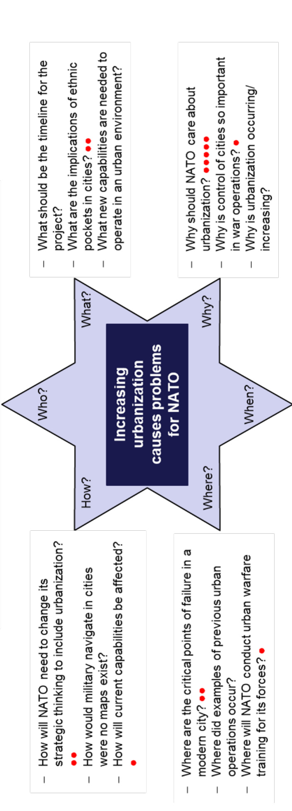  
Figure 11 – Generated and prioritized questions  

# Hints and tips  

 Go through one point of the star at a time, and carefully plan the order of the sequence to yield the best result. The usual arrangement is: what, why, who, where, when, how.   
Do not necessarily draw a star if you have only limited wall space available. Alternatively, use one flip chart for each point of the star.   
 Use starbursting to critically examine a document such as a point paper or handbook. First, generate the questions the document should answer, then examine it to see if they are covered.  

# Further reading  

https://www.mindtools.com/pages/article/newCT_91.htm Website about starbursting. https://business.tutsplus.com/tutorials/starbursting-how-to-use-brainstormingquestions-to-evaluate-ideas--cms-26952 Website about starbursting.  

# Six Thinking Hats  

(for individual or 2–10 people; medium)  

A technique that encourages you to look at situations, problems, or decisions from a number of perspectives. This involves separating factual, emotional, negative, positive, creative, and summarizing views, and further representing each one by a coloured “hat”. By moving outside your habitual thinking styles and by being more mindfully involved in a structured process, you gain a more rounded and enlightened view of the subject.  

# What to use it for  

managing situations affected by strong emotions, different viewpoints about a problem, or personal commitments to previous decisions making a logical and informed decision by considering all aspects of a situation   
evaluating a situation, document, or operational plan in detail  

# Application  

Six thinking hats revolves around the group “wearing” specific hats that are connected to certain ways of looking at a problem. The six different hats are:  

White (factual) hat: Wearing the white hat, you are neutral and focus on the available data. For this purpose, look at this information and see what you can learn from it. Also look for gaps in your knowledge, and either try to fill them or take account of these shortcomings. Additionally, analyse past trends, and attempt to extrapolate from historical data.  

Red (feelings) hat: Wearing the red hat, you look at problems using intuition, gut reaction, and emotion. Moreover, try to think about their impact on other people and how they will react emotionally. In particular, seek to understand the responses of people who do not fully know your reasoning.  

 Black (negative) hat: Wearing the black hat, you take all the bad points of a decision or situation into account. So look at them cautiously and defensively, and try to see why they might not work. This is important because it highlights the weak points in a plan. Consequently, you can eliminate them, alter them, or prepare contingency plans to counter them. In other words, black-hat thinking makes your plans more resilient. It can also help you to spot fatal flaws and risks before you embark on a course of action.  

Yellow (positive) hat: Wearing the yellow hat, you think positively. Take an optimistic viewpoint to see all the benefits of a decision or situation and to identify the value in it.  

 Green (creative) hat: Wearing the green hat, you develop creative solutions to a problem. It is a freewheeling and imaginative way of thinking in which there is little to no criticism of ideas. Stress what can be and not what is.  

Blue (control) hat: Wearing the blue hat, you control the process. This is the hat worn by the AltA facilitator who concentrates on controlling the process and time management. You can also use it to focus participants on the big picture or the issue at hand. Alternatively, employ the blue hat as a way of summarizing the discussions to conclude the process. Figure 12 depicts a suggested way to order the hats.  

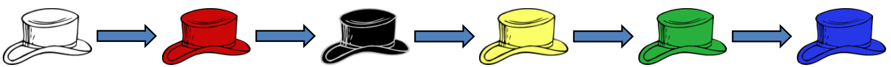  
Figure 12 – Suggested Ordering of Hats  

Step 1: Define topic. Write down the problem statement and the goal of the group before starting.  

Step 2: Wear each hat in turn. The designated AltA facilitator wears the blue hat to control the session. Meanwhile, the other participants wear the remaining hats in sequence and brainstorm (see page 31) the problem together from the corresponding perspective. That is, all of them are wearing the same coloured hat at the same time. Record the voiced comments in a separate place for each hat.  

Step 3: Organize results. Structure the generated ideas once you have completed step 2 to meet the requirements laid out in the problem statement. This may take the form of a list of recommendations, considerations, etc.  

# Example  

The participants of an AltA session applied the six thinking hats technique during the review of a working draft of NATO’s security force assistance doctrine19. During this review, one of the doctrine writers was present and took note of the statements made.  

Step 1: Define topic. First, the AltA facilitator asked the group to examine major sections of the doctrine one by one. For example, they first reviewed the section titled “Generate” which describes the corresponding activity in the security force assistance process.  

Step 2: Wear each hat in turn. Table 5 shows part of the comments the participants expressed on the paragraph while wearing the corresponding hat. Note that the AltA facilitator chose the ordering of the hats in advance.  

Step 3: Organize results. The group collected a total of around 60 comments before they moved on to the next paragraph. In the end, the attendant doctrine writer received a list of recommended changes to the document that the whole group agreed on.  

# Hat  

# Comments  

Table 5 – Comments on paragraph grouped by hats   

<html><body><table><tr><td>First impression/ gut reaction</td><td>Three people liked the paragraph. Two did not like it. One had mixed feelings.</td><td></td></tr><tr><td>Facts/information that is missing</td><td></td><td>but there ismore to it. Points to clarify: What is the definition of manpower? What is a sharing agreement? O Whatareadministrativereprocesses?</td></tr><tr><td>Positive points/ benefits</td><td></td><td>It gives a general framework and covers the most important points. It covers supporting infrastructure and associated systems.</td></tr><tr><td>Negative points/ What could go wrong</td><td></td><td>One sentence reads, "lt would be wrong to assume that generate action is is not the first stage". The “Generate" paragraph implies that NATO will be in the lead when "Generate" may be transitioned over to the host nation. Also, NATO may not be in the lead but merely providing advice.</td></tr><tr><td>Things to improve</td><td></td><td>Include the fact that the NATO commander needs to take into account the political situationwhen working out how to generate the force. Make clear that“Generate" also requires other skill sets related to capabil- ity building.</td></tr><tr><td>Summary/big pic- ture</td><td></td><td>The paragraph is useful as it gives guidance. However, we need some con- text, e.g. a scenario, in order to assess its full utility.</td></tr></table></body></html>  

  

# Benefits  

Six thinking hats:  

creates decisions and plans that will mix ambition, skill in execution, public sensitivity, creativity, and good contingency planning.   
ensures that all perspectives are considered. promotes parallel thinking, not confrontation and argumentation.  

 forces natural optimists/pessimists to look at a situation from the other perspective.  

# Challenges  

Six thinking hats:  

requires a strategy to deal with thoughts that are not consistent with the current hat. After all, everyone must wear the same hat at the same time. A good solution is to use a parking lot for the thought, then (re)visit the appropriate hat later (see Part 3 of this handbook for more details). may compel participants wearing the red hat to justify their opinions (“I think this way because of …”). Stop them giving reasons for their feelings as these reasons will fall under one of the other hats. causes difficulties in distinguishing between the red and the black hat when people get emotional about negative issues.  

# Hints and tips  

Adjust the suggested order of the hats (white, red, black, yellow, green, blue) beforehand depending on the composition of the group and the nature of the problem. When you evaluate decisions for example, the yellow and black hats can be used to assess strengths and weakness of options generated by a green-hat session.   
 Prepare the space for the six hats in advance. For instance, divide a whiteboard into six segments or use six flip charts placed side by side. Do not employ this technique by assigning different hats to different individuals at the same time. This way, you risk losing one of the main benefits of the technique when the discussion becomes confrontational. Besides, you limit the brainpower applied to each hat. Describe the red hat as “your opinion” or “your gut reaction” instead of the “feelings” hat, as is habitually done. This is because military officers are often uncomfortable about expressing emotions in a professional setting.   
 Use this technique with a larger group by distributing six flip charts across the room, each one representing a hat. Divide the participants into six groups, and have each group look at a single flip chart, i.e. hat. After approximately ten minutes, rotate the groups around the room so each one gets to view and comment on each hat.  

# Further reading  

 de Bono E. Lateral thinking: creativity step by step. 1st U.S. ed. New York: Harper & Row, Publishers; c1970.   
de Bono E. Six thinking hats. 1st Back Bay pbk. ed., rev. and updated. Boston: Back Bay Books; 1999.  

# Creative Combinations  

(for individual or 2–10 people; hard)  

A technique that breaks down a situation or problem into its key dimensions, restructures it, and provides a framework in which to evaluate various solutions. Creative combinations presents the whole scope of the problem in a single table in order to facilitate understanding.  

# What to use it for  

· envisaging many different types of future scenarios in scenario planning obtaining a holistic view of a situation  

# Application  

Step 1: Identify dimensions. Recognize the main dimensions that define your problem, and create a table with these listed along the top row. This is illustrated in the header row of Table 7.  

Step 2: Identify values. Find distinct values for each dimension which represent possible conditions these can assume. Insert them into the corresponding columns; different dimensions can have different numbers of values, as you can see in Table 6.  

Table 6 – Full table of the problem   

<html><body><table><tr><td>Dimension1</td><td>Dimension 2</td><td>Dimension3</td><td>Dimension 4</td><td>Dimension 5</td></tr><tr><td>D1:Value1</td><td>D2:Value 1</td><td>D3:Value 1</td><td>D4:Value1</td><td>D5:Value1</td></tr><tr><td>D1:Value2</td><td>D2:Value2</td><td>D3:Value2</td><td>D4:Value2</td><td>D5:Value2</td></tr><tr><td>D1:Value3</td><td></td><td>D3:Value3</td><td>D4:Value3</td><td>D5:Value3</td></tr><tr><td></td><td></td><td>D3:Value4</td><td></td><td></td></tr></table></body></html>  

Step 3: Consider different combinations. Highlight one value from each dimension, an example of which is depicted in Table 7. Next, ensure that your selection has no logical contradictions; each of such combinations represents now a different scenario. Afterwards, discuss the relevant scenarios in the group.  

Table 7 – Combination representing a scenario   

<html><body><table><tr><td>Dimension1</td><td>Dimension 2</td><td>Dimension 3</td><td>Dimension 4</td><td>Dimension 5</td></tr><tr><td>D1:Value1</td><td>D2:Value1</td><td>D3:Value1</td><td>D4:Value1</td><td>D5:Value1</td></tr><tr><td>D1:Value2</td><td>D2:Value2</td><td>D3:Value2</td><td>D4:Value2</td><td>D5:Value2</td></tr><tr><td>D1:Value3</td><td></td><td>D3:Value3</td><td>D4:Value3</td><td>D5:Value3</td></tr><tr><td></td><td></td><td>D3:Value4</td><td></td><td></td></tr></table></body></html>  

# Example  

A working group wished to identify a range of possible future scenarios that characterized the term “NATO expeditionary operations”20. Thus, the group members decided to apply creative combinations to identify all possible future scenarios and then discuss which would be “expeditionary” and which not.  

Step 1: Identify dimensions. The group began by deliberating on the criteria that define a scenario, which they consequently turned into the main dimensions. Refer to the header row of Table 8 for a subset of their results.  

Step 2: Identify values. The participants went on to determine the different values within each dimension and fill out the table, which you can see in Table 8.  

Table 8 – NATO operations' full table   

<html><body><table><tr><td>Distance</td><td>Scale</td><td>Missiontype</td><td>Physical ronment</td><td>envi-</td><td>Threat</td></tr><tr><td>WithinNATO</td><td>Substate</td><td>Power project</td><td>Rural</td><td></td><td>Permissive</td></tr><tr><td>OutofNATO</td><td>Country</td><td>Evacuation</td><td>Urban</td><td></td><td>Non-permissive</td></tr><tr><td></td><td>Regional</td><td>Humanitarian operation</td><td>Littoral</td><td></td><td></td></tr><tr><td></td><td>Global</td><td>Peacekeeping</td><td>Antarctic</td><td></td><td></td></tr></table></body></html>  

Step 3: Consider different combinations. Next, the group selected a single combination and discussed this particular scenario. With the combination in Table 9 for instance, the participants explored military options for a humanitarian relief operation at substate level belonging to a NATO partner.  

Table 9 – Valid scenario for NATO operation   

<html><body><table><tr><td>Distance</td><td>Scale</td><td>Missiontype</td><td>Physical ronment</td><td>envi-</td><td>Threat</td></tr><tr><td>Within NATO</td><td>Substate</td><td>Power project</td><td>Rural</td><td>Permissive</td><td></td></tr><tr><td>Out of NATO</td><td>Country</td><td>Evacuation</td><td>Urban</td><td></td><td>Non-permissive</td></tr><tr><td></td><td>Regional</td><td>Humanitarian operation</td><td>Littoral</td><td></td><td></td></tr><tr><td></td><td>Global</td><td>Peacekeeping</td><td>Antarctic</td><td></td><td></td></tr></table></body></html>  

Then the group explored other combinations. The one in Table 10 is not valid because it has a logical contradiction – an operation in the Antarctic that is within NATO. Also, the setting is unlikely to be non-permissive if the nation is a NATO member. By discounting the present contradictions this way, the number of valid combinations decreases drastically.  

Table 10 – Invalid scenario for NATO operation   

<html><body><table><tr><td>Distance</td><td>Scale</td><td>Mission type</td><td>Physical ronment</td><td>envi- Threat</td><td></td></tr><tr><td>Within NATO</td><td>Substate</td><td>Power project</td><td>Rural</td><td>Permissive</td><td></td></tr><tr><td>OutofNATO</td><td>Country</td><td>Evacuation</td><td>Urban</td><td></td><td>Non-permissive</td></tr><tr><td></td><td>Regional</td><td>Humanitarian operation</td><td>Littoral</td><td></td><td></td></tr><tr><td></td><td>Global</td><td>Peacekeeping</td><td>Antarctic</td><td></td><td></td></tr></table></body></html>  

# Benefits  

Creative combinations:  

 explores many situations or problems by considering various combinations.   
 stretches your thinking in a number of different directions.  

# Challenges  

Creative combinations:  

 takes time in getting the table to a point where it accurately describes the situation or problem. Hence, you often conduct it over a series of one- or two-day workshops, where each workshop refines the table. compels you to recognize different types of contradictions. That is because some scenarios may not be valid due to logical contradictions (e.g. the Antarctic is not within NATO). Equally, a combination can have a normative constraint rendering it unlikely due to NATO policy (e.g. a non-permissive humanitarian operation).  

# Hints and tips  

 Describe the problem’s scope in seven or fewer dimensions, in which case this method works best. Bear in mind that creative combinations originates from morphological analysis. You can find details on this more advanced technique under “Further reading” below.  

# Further reading  

Collins S, Purton S. Getting off to a good start: improving definitions using morphological analysis. Neuilly-sur-Seine: NATO Research and Technology Organization; 2010 Apr. Report No.: RTO-MP-SAS-081. www.swemorph.com Website about morphological analysis.  

# 4 Diagnostic Techniques  

# Strengths, Weaknesses, Opportunities, Threats (SWOT) Analysis  

(for individual, 2–10, or more than 10 people; easy)  

A technique that increases understanding of the strengths, weaknesses, opportunities, and threats that you may face in the future. Table 11 describes the meaning of these elements as used in the SWOT model.  

Table 11 – SWOT model   

<html><body><table><tr><td>Helpful</td><td></td><td>Harmful</td></tr><tr><td>Internal</td><td>Strengths Factors of a project/team/course of action thatgiveit anadvantageoverothers</td><td>Weaknesses Factorsthatplacetheproject/team/course ofactionatadisadvantagerelativetooth- ers</td></tr><tr><td>External</td><td>Opportunities Factors that the project/team/course ofFactorsin the environment that could actioncouldexploittoitsadvantage</td><td>Threats causetroublefortheproject/team/course of action</td></tr></table></body></html>  

# What to use it for  

 evaluating a team, capability, or chosen strategy planning on the strategic and operational level providing an alternative perspective on a particular course of action  

# Application  

Phase A: Determine factors.  

Step 1: Identify factors using SWOT model. Use the brainstorming technique to identify the relevant factors for each element as exemplified in Table 12. Remember for this that strengths and opportunities are helpful factors, in contrast to weaknesses and threats, which are harmful. Moreover, strengths and weaknesses are internal factors, which means that the resources and experience are readily available. Opportunities and threats meanwhile are external factors which you often cannot control directly. Stop after this step if you consider the analysis to have served its purpose.  

Table 12 – Identified factors labelled with numbers   

<html><body><table><tr><td></td><td>Helpful</td><td>Harmful</td></tr><tr><td>Internal</td><td>Strengths</td><td>Weaknesses</td></tr><tr><td></td><td>S1 S4</td><td>W1 W4</td></tr><tr><td>S2</td><td>S5</td><td>W2 W5</td></tr><tr><td>S3</td><td>S6</td><td>W3 W6</td></tr><tr><td>External</td><td>Opportunities</td><td>Threats</td></tr><tr><td>01</td><td>04</td><td>T1 T4</td></tr><tr><td>02</td><td>05</td><td>T2 T5</td></tr><tr><td>03</td><td>06</td><td>T3 T6</td></tr></table></body></html>  

Step 2: Prioritize factors. Employ the following techniques to score the different elements:  

Plot opportunities and threats onto a risk matrix in order to identify the most important factors. To do this, assess for each factor the probability that the opportunity or threat occurs, and contemplate likewise the impact if it did occur. Refer to Figure 13 for an illustration. The most important factors will now presumably reside in the top right quadrant of the matrix. These are likely to take place and entail severe consequences.  

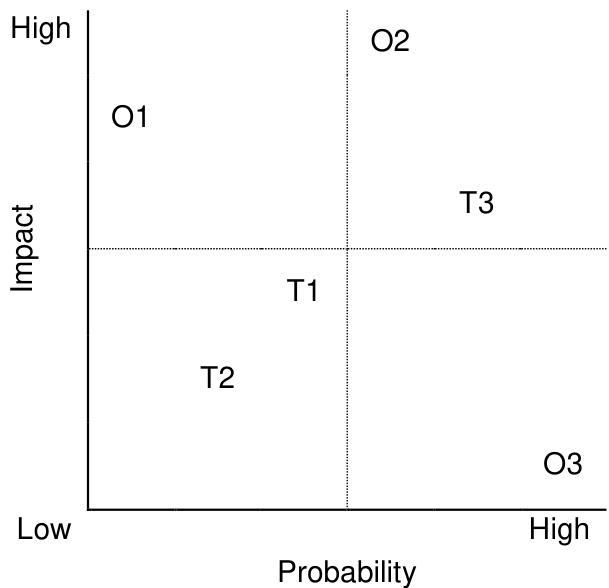  
Figure 13 – Risk matrix for opportunities O and threats T  

 Prioritize strengths and weaknesses objectively by using metrics to assess how important each factor is. Alternatively, you can do the same subjectively by simply facilitating a group consensus on their priority. Table 13 illustrates a possible result.  

# Table 13 – Prioritization of strengths and weaknesses  

Phase B: Determine plan or strategy.  

Step 3: Identify primary factors using confrontation matrix. Develop a confrontation matrix by listing opportunities and threats on the left and strengths and weaknesses along the top of the matrix. Arrange them further in the prioritized order found in step 2. But use only the higher prioritized factors in case you have identified too many in the beginning. This prevents the matrix from becoming too big to handle. Next, conduct a confrontation exercise with the group by asking the following questions:  

For each opportunity – which strengths help us to take advantage of it? And which weaknesses inhibit us from doing so?   
For each threat – which strengths help us to fight it? And which weaknesses inhibit us from doing so?  

Now populate the matrix using a $^{66}+^{,5}$ for positives you can exploit and a “-” for negatives you have to handle. More of these plusses or minuses in a cell demonstrate a stronger positive or negative issue for you to address. If an entire column or row is eventually empty, you likely did not address the corresponding factor; Figure 14 depicts such instances as red lines. Hence, conduct some further brainstorming to identify how to manage them.  

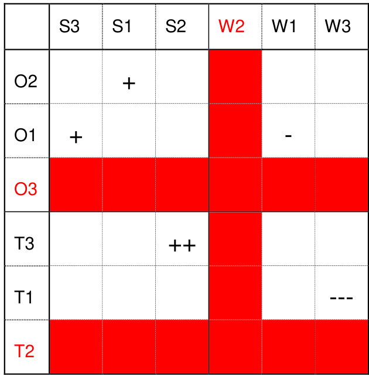  
Figure 14 – Completed confrontation matrix  

Step 4: Evaluate actions. Develop an action plan using the confrontation matrix to help address the positive and negative issues that require attention. The most important opportunities and threats from step 2 should be included in this action plan. Then evaluate your actions against where the issues have been identified in the matrix; Figure 15 shows how you need to address these different concerns.  

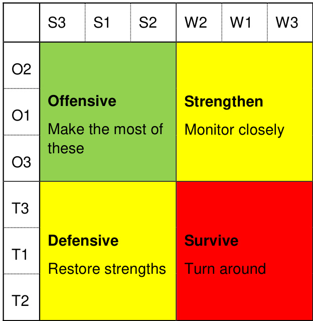  
Figure 15 – Evaluation of confrontation matrix  

Phase C: Implement action plan.  

Step 5: Initiate plan, monitor progress, re-evaluate. Observe the plan’s progress by using appropriate metrics and reconduct a SWOT analysis when appropriate to examine the changes since its initiation.  

# Example  

NATO held an AltA session to identify the SWOTs of its concept development and experimentation (CD&E) in order to improve this capability.  

# Phase A: Determine factors.  

Step 1: Identify factors using SWOT model. In a first step, a cross-functional team of customers and implementers of CD&E in NATO brainstormed to identify factors. For this purpose, the AltA facilitator posed a future scenario to the group: Imagine a future without NATO CD&E. Table 14 shows a small part of the factors the team found inside the SWOT model.  

Table 14 – Identified factors affecting CD&E   
Table 15 – Strengths/weaknesses scoring   

<html><body><table><tr><td colspan="3">Helpful</td><td colspan="2">Harmful</td></tr><tr><td>Internal</td><td>Strengths</td><td></td><td>Weaknesses</td><td></td></tr><tr><td rowspan="7"></td><td>S1</td><td>Availability of dedicated and trainedW1 staff</td><td></td><td>Perception that NATO CD&E does not deliver worthwhile products</td></tr><tr><td>S2</td><td>Delivery of unbiased results</td><td>W2</td><td>Limited relationship with NATO HQ</td></tr><tr><td>S3</td><td>Enabling of burden sharing</td><td>W3</td><td>Insufficient  shared   understanding when initiating CD&E</td></tr><tr><td>S4</td><td>Enhancing of interoperability</td><td>W4</td><td>Lack of formal method for evaluating success</td></tr><tr><td>External Opportunities</td><td></td><td>Threats</td><td></td></tr><tr><td>01</td><td>Exploitation with academia and in- T1 dustry</td><td></td><td>Dependency on political climate</td></tr><tr><td>02</td><td>Subject-matter experts from Centres T2 Manpower reductions in NATO of Excellence</td><td></td><td></td></tr><tr><td></td><td>03</td><td>Increased threat to NATO mem- T3 bers - increases drive for innovation</td><td></td><td>Occurrence of technological innova- tions too fast for CD&E to keep up</td></tr><tr><td></td><td>04 ronment</td><td>Rapidly  changing  operational envi-  T4</td><td></td><td>Abandoning of national CD&E and reliance on NATO</td></tr></table></body></html>  

Step 2: Prioritize factors. Next, the group used two methods to prioritize the factors. First, they scored strengths (S) and weaknesses (W) against the importance to deliver successful CD&E and their overall implications for NATO, as shown in Table 15. Second, they assessed opportunities (O) and threats (T) using a risk matrix; see Table 16 for their results. In both cases, the participants voted on the place of each factor in the matrices.  

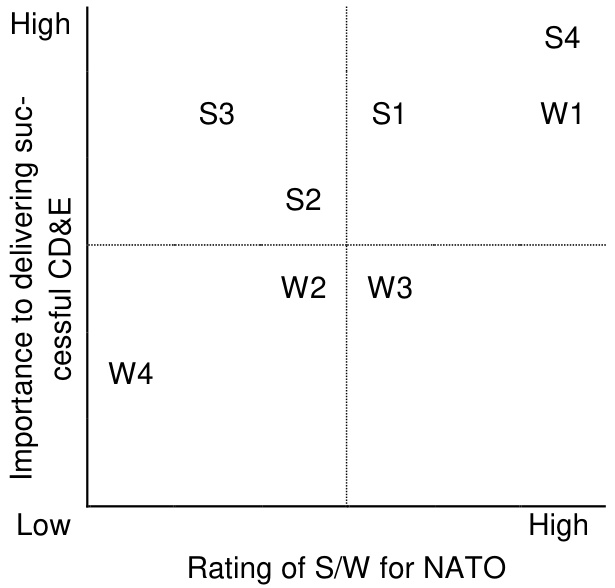  

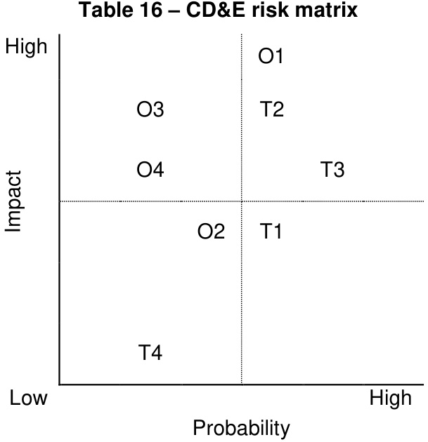  

After that, they prioritized the factors according to how close these were to the matrices’ top right corner. Table 17 lists those findings in their determined order.  

<html><body><table><tr><td colspan="4">Table17-NATOCD&E'sprioritizedSWOTs</td></tr><tr><td rowspan="3">High Priority LoW</td><td>1. S4 W1</td><td>01</td><td>T2</td></tr><tr><td>2. S1 3.</td><td>W3 03</td><td>T3</td></tr><tr><td>S2 4. S3</td><td>W2 04</td><td>T1</td></tr><tr><td colspan="2"></td><td>W4 02</td><td>T4</td></tr></table></body></html>  

Phase B: Determine plan or strategy.  

Step 3: Identify primary factors using confrontation matrix. Subsequently, the team developed a confrontation matrix template using the factors and their prioritization identified in the preceding steps. After this, they filled in the matrix to examine the primary and pertinent factors they have to take into account. Refer to Figure 16 for the completed confrontation matrix; for conciseness, this example shows only the two factors of highest priority for each element. In practice, however, more factors were included.  

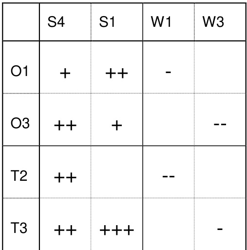  
Figure 16 – Completed confrontation matrix for CD&E  

Step 4: Evaluate actions. Afterwards, the team used the confrontation matrix to identify the key actions required. For instance, the matrix shows that in order to exploit relationships with academia and industry (O1), the core cadre of NATO CD&E staff should be leveraged (S1). On the other hand, a danger is that this opportunity will be prevented by the negative perception of products (W1). Hence, the group made a strategy recommendation to task the NATO CD&E staff to identify how the application of academic products is improved, and how reports are marketed in general. This exemplifies how you can transform a weakness into a strength.  

# Phase C: Implement action plan.  

Step 5: Initiate plan, monitor progress, re-evaluate. Once the NATO CD&E staff had implemented their campaign, it developed metrics to monitor its effectiveness. One year  

later they conducted another SWOT analysis to determine if the same weaknesses or threats persisted and if the strategy is working.  

# Benefits  

SWOT analysis:  

can be applied to almost any decision-making process irrespective of its size to identify new perspectives. organizes information, clearly presents solutions, spots roadblocks, and emphasizes opportunities.   
 develops a full awareness of all factors that may affect a decision or a plan. identifies priorities in tasks and activities.   
 illustrates how to transform weaknesses into strengths and threats into opportunities, to match strengths to exploit opportunities, and to prevent threats from becoming a weakness.  

# Challenges  

SWOT analysis:  

may misrepresent strengths, weaknesses, opportunities, and threats if you use it on its own without critical thought and analysis. impedes brainstorming the possibilities and identifying the barriers if you mishandle it to simply defend previously decided objectives or courses of action.  

# Hints and tips  

Many teams stop after step 1 due to limited time for the SWOT session; this is OK if it serves its purpose   
Accept only precise, verifiable statements when identifying factors.   
 Ensure you carry out the convergent phase during the brainstorming in step 1 by ruthlessly pruning long lists of factors. This will give you time to consider the most significant ones. Capture those factors that did not make it onto the final list for future use and/or trend analysis.  

# Further reading  

Osita IC, Onyebuchi I, Justina N. Organization’s stability and productivity: the role of SWOT analysis. International Journal of Innovative and Applied Research. 2014 Sep;2(9):23–32. https://www.mindtools.com/pages/article/newTMC_05.htm Web page about SWOT analysis.  

# Plusses, Minuses, Interesting (PMI)  

(for individual, 2–10, or more than 10 people; easy)  

A very simple technique that weighs up the pros and cons as well as any interesting points regarding a decision by contrasting them with each other.  

# What to use it for  

evaluating decisions or set of options conducting a quick analysis of a subject  

# Application  

Step 1: Define topic. Select a particular problem, decision, or subject that is the focus of your analysis; be specific in defining it. Now put this statement at the top of a blank piece of paper or whiteboard, and draw three columns labelled “Plusses”, “Minuses”, and “Interesting” below.  

Step 2: Brainstorm each column. Use brainstorming (see page 31) or brainwriting (see page 40) to find possible positive effects of your topic; note them down in your table under “Plusses”. Afterwards, write down all possible negative effects under “Minuses”. Finally, think of the “Interesting” broader implications and consequences. See Table 18 for a description of the table content.  

Table 18 – PMI table   

<html><body><table><tr><td colspan="4">Statementof problem,decision, or subject</td></tr><tr><td colspan="2">Plusses</td><td>Minuses</td><td>Interesting</td></tr><tr><td></td><td>Why you like it</td><td>Why you do not like it</td><td>What you find interesting about it</td></tr><tr><td></td><td>Good things about it</td><td>Bad things about it</td><td>What it tells you about the</td></tr><tr><td></td><td>Benefits of it</td><td>Potential problems of it</td><td>status quo</td></tr><tr><td></td><td></td><td></td><td>Future implications</td></tr></table></body></html>  

Step 3: Score each item (optional). Rank each point made in the three columns in case the results are not clear. To do this, apply a scale of 1 to 5 for “Plusses” and “Interesting” and -1 to -5 for “Minuses”. Although these scores are subjective, they will likely force you to rethink your ideas and how much you value certain outcomes.  

# Example  

The participants of a NATO workshop on joint air power (JAP) strategy reviewed definitions of JAP used by other military organizations within the PMI framework. One of these reviews is outlined below.  

Step 1: Define topic. The AltA facilitator asked the participants what was good, bad, and interesting in the following definition: “Air power is the ability to project military power or influence through the control and exploitation of air, space, and cyberspace to achieve strategic, operational, or tactical objectives.”21  

Step 2: Brainstorm each column. The participants next brainstormed this definition; a part of their comments are captured in Table 19.  

Table 19 – Example PMI table   

<html><body><table><tr><td colspan="4">What is good, bad, and interesting in this definition of JAP?</td></tr><tr><td colspan="2">Plusses Minuses</td><td colspan="2">Interesting</td></tr><tr><td></td><td>Comprehensive</td><td>Cyberspace inclusion in air power definition still a con-</td><td>Howtocontrolcyber-</td></tr><tr><td></td><td>Complete</td><td>tested issue</td><td>space? Militaryinfluence?</td></tr><tr><td></td><td>Concise</td><td>Typeofobjectivessuper-</td><td>Useofcyberspaceas</td></tr><tr><td></td><td></td><td>fluous</td><td>space</td></tr><tr><td></td><td></td><td>Jointnotmentioned</td><td></td></tr></table></body></html>  

Step 3: Score each item (optional). Finally, the group voted on these comment to establish a score. See Table 20 for the ratings.  

Table 20 – Example PMI table with scores   

<html><body><table><tr><td colspan="4">What is good, bad, and interesting in this definition of JAP?</td></tr><tr><td colspan="2">Plusses</td><td colspan="2">Minuses Interesting</td></tr><tr><td></td><td>Comprehensive (5)</td><td>Cyberspaceinclusioninair</td><td>Howto control cyber-</td></tr><tr><td></td><td>Complete (3)</td><td>power definition still a con- tested issue (-3)</td><td>space? (2) Military influence? (3)</td></tr><tr><td></td><td>Concise (3)</td><td>Typeof objectivessuper-</td><td>Useofcyberspaceas</td></tr><tr><td></td><td></td><td>fluous (-2)</td><td>space (2)</td></tr><tr><td></td><td></td><td>Joint not mentioned (-3)</td><td></td></tr></table></body></html>  

These results were eventually used to improve NATO’s definition of JAP.  

# Benefits  

PMI:  

allows you to look at a topic from different angles.  

takes little time to complete, but is nevertheless very effective.  

# Challenges  

PMI:  

oversimplifies the topic under discussion and may not explore it in sufficient detail. In that case, six thinking hats (see page 49) may be more appropriate. requires a genuine effort when thinking of negative consequences.  

# Hints and tips  

Set a time limit for the brainstorming depending on the scope and difficulty of the topic, e.g. one minute per column for a simple one. Capture “good ideas” under “Interesting” when evaluating already completed projects, since this column will be less relevant in these circumstances.  

# Further reading  

https://www.mindtools.com/pages/article/newTED_05.htm Web page about PMI.   
https://www.stickyminds.com/article/mind-changing-exercise Web page about PMI.  

# Five Whys  

(for individual, 2–10, or more than 10 people; easy)  

A technique that aids in identifying the root cause(s) of a problem by asking "why" five times. This is a remarkably simple way to uncover the nature and source of both single-track and multitrack problems. In the former, you face only a single causal chain from your problem to the root cause. In the latter on the other hand, your problem has several initial causes, and you address each one by its own track of “why” questions.  

# What to use it for  

finding the causes of simple problems and distinguishing them from their symptoms determining the relationship between different root causes of a problem  

# Application  

Step 1: Define topic. Select a problem to focus on, and be specific in defining it. Even so, keep the scope small and realistic.  

Step 2: Identify initial cause(s). Find the immediate reasons that cause the problem. While you will have only one initial cause in a single-track problem, you will identify many more in a multitrack one.  

Step 3: Ask “why” as many times as necessary. Ask “Why is this a problem?” for one of the initial causes; then repeat the same question for the cause you just uncovered. Continue asking five times or until you have found the root cause. Subsequently, repeat the probing for each of the remaining initial causes.  

Step 4: Discuss and select solutions. Look for solutions to the problem and make sure they address its root causes; this reduces the likelihood of the problem reoccurring.  

# Example  

A working group in NATO used five whys to explore why the analysis of human social networks (HNA) for intelligence is a challenging problem.  

Step 1: Define topic. The problem the group members wanted to address was: “Problems with NATO Human network analysis”. The AltA facilitator then wrote this statement in the middle of a whiteboard.  

Step 2: Identify initial cause(s). Since this was a multitrack problem, the participants first brainstormed the initial causes of the problem. Next, they placed their findings on sticky notes in a circle around the problem statement as illustrated in Figure 17.  

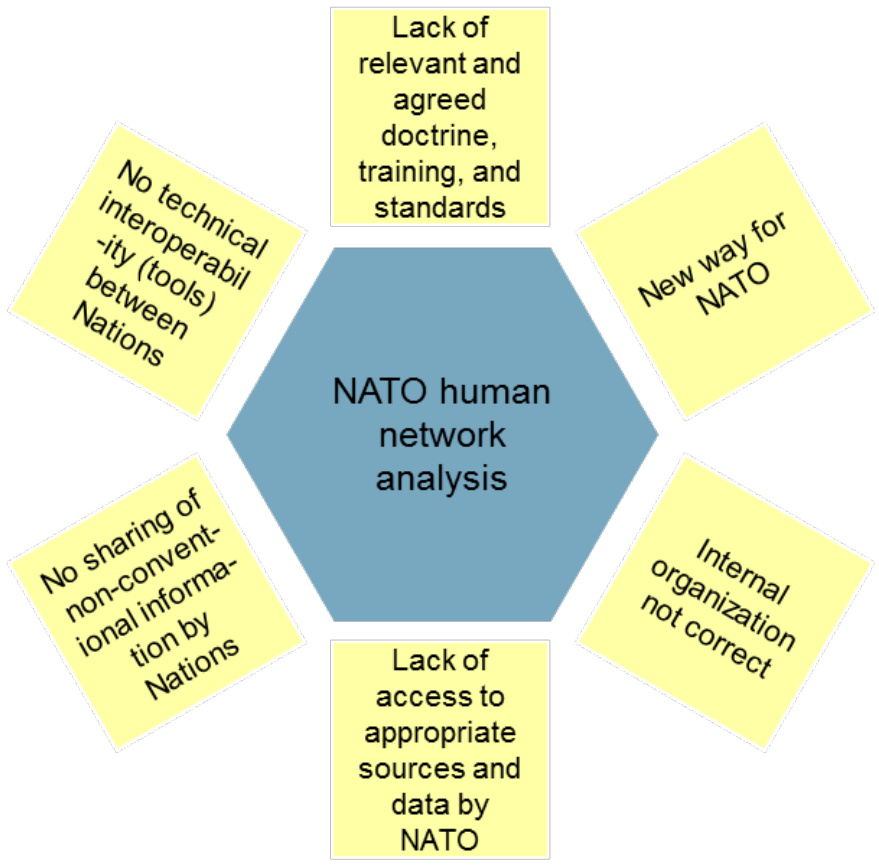  
Figure 17 – Problem statement and initial causes  

Step 3: Ask “why” five times. Afterwards, the AltA facilitator took each of these initial causes in turn and expanded on them outwards by radiating away from the circle on the whiteboard. The group kept asking “why” over and over until the root cause for every initial cause was found. Table 21 organizes part of the final outcome of this questioning in tabular form.  

Step 4: Discuss and select solutions. Finally, the participants discussed the veracity of the uncovered root causes and looked for possible solutions to tackle them. By the time the workshop had finished, the project group has developed a greater understanding of the problem. They were consequently able to develop a more focused strategy to address particular issues.  

Table 21 – Problem statement with subset of uncovered root causes   

<html><body><table><tr><td colspan="5">Human network analysis does not work in NATO</td></tr><tr><td></td><td>Why? Lack of relevant and agreed doctrine, training, and stand- ards.</td><td>Internal organization is not correct.</td><td>No sharing of non- conventional infor- mation by Nations.</td><td>No technical in- teroperability (tools) between Nations.</td></tr><tr><td>Why?</td><td>Lack of relevant HNA doctrines by Nations.</td><td>Promotion of non- HNA intelligence view by structure of J2, G2, etc.</td><td>Limited sharing of PMESlI22 infor- mation by Nations.</td><td>No data format and exchange standards for HNA, no shared database.</td></tr><tr><td>Why?</td><td>View that military intel should be ori- ented against na- tion-state threats predominates.</td><td>Lack of appropriate HNA directive or policy for NATO.</td><td>Only sharing of fin- ished intel products by Nations.</td><td>Complex stakehold- er requirements.</td></tr><tr><td>Why?</td><td></td><td>Unwillingness of Nations tobearcost implications of such directive.</td><td>askforsharingoft 1information.</td><td>Nations not used to No inclusion of in- ternal and non-state threatsintoNATO's mission by Nations.</td></tr></table></body></html>  

# Benefits  

Five whys:  

prevents problems from reoccurring by addressing their root causes, rather than just managing the symptoms.   
diagnoses problems with complex and bureaucratic organizational processes. identifies a root cause very quickly in a simple manner.   
links up to more complex systems analysis methods that analyse linkages between the chains of whys.  

# Challenges  

Five whys:  

requires the right problem statement in order to be successful. reaches its limits when dealing with complex problems where you have difficulties distinguishing between symptom and cause.  

# Hints and tips  

Remember that the number five is arbitrary; the point is not the number, but the probing. Although you usually need to ask “why” five times to get to the root cause, sometimes you require 4, 6, or 8 times. The complexity of the problem basically dictates how far you go.  

 Pose different “why” questions. In particular, asking “Why is this an issue?” may have a different answer than “Why is this important?”, or “Why do we need to fix this?” Ask the team to look at the problem from other people’s perspectives (e.g. a customer) to better understand why they have to fix the problem. If people with different backgrounds can come to the session, all the better. Invite people having hands-on experience of the process being examined to maximize the technique’s effectiveness. Expect difficulties as the AltA facilitator, because the participants may see you as questioning the norm and the competence of those who run the process.  

# Further reading  

 Sayer NJ, Williams B. Lean for dummies. 2nd ed. Hoboken (NJ): John Wiley & Sons; c2012. Joint Analysis and Lessons Learned Centre. The NATO lessons learned handbook. 3rd ed. Lisbon: North Atlantic Treaty Organization. 2016 Feb. https://hbr.org/2012/02/the-5-whys.html Video tutorial about five whys.  

# Key Assumptions Identification  

(for individual or 2–10 people; easy)  

A technique that systematically identifies the assumptions guiding your interpretation of evidence and reasoning about a particular subject. It subsequently judges which ones are the key assumptions in a decision-making process.  

# What to use it for  

 handling projects in an early stage or when entering a new phase of them · explaining current events or estimating about future events  managing large assumptions you made in order to advance on your project checking the integrity of your plan  

# Application  

Step 1: Review current line of thinking. Assess what the existing reasoning on an issue appears to be; then write it down for all participants of the session to see it.  

Step 2: Identify all assumptions. Find and articulate all assumptions that you believe must be accurate for the line of thinking to be valid. To this end, include premises both stated and unstated in the available information.  

Step 3: Identify key assumptions. Challenge each premise by asking whether it necessarily has to be true for the line of reasoning to be valid. Also check whether the assumption remains true under all conditions. List those that must be correct as your key assumptions.  

Step 4: Evaluate key assumptions. Focus your further research on this narrowed list of key assumptions in order to conserve resources. Additionally, consider under what conditions or in the face of what information these might not hold, and analyse their implications for the line of thinking. To do this, evaluate the points on your refined list in terms of the following questions:  

 How much confidence exists that the assumption is correct? ? What explains the degree of confidence in the assumption?  What circumstances or information might undermine the assumption? Is a key assumption more likely a key uncertainty or key factor? ? Could the assumption have been true in the past but less so now? · If the assumption proves to be wrong, would it significantly alter the plan? How? Has the process identified new factors that need further analysis?  

# Example  

Although not from NATO, the post-Six-Day-War plan of the Israel Defense Forces (IDF) for defending the Sinai Peninsula provides a good military example to show this method in use.  

Following the Six-Day War in 1967, Israel held the Sinai Peninsula, but needed to economize on its forces on alert there to keep costs down. The IDF’s Chief of General Staff Haim Bar-Lev consequently approved a plan to fortify the Suez Canal line. These defences, called the Bar-Lev Line, comprised forts and a 10-meter-high sand berm on the canal bank that was impassable to vehicles. The decisive victory in the last war made Israel feel that its forces were invincible and its intelligence services dominant and highly effective. Moreover, Egypt alone was considered too weak to defeat Israel, a view even held by the Egyptians themselves.  

# Step 1: Review current line of thinking.  

The line of reasoning governing the IDF’s planning can be summarized as follows.  

In order to defeat an Egyptian attack, Israel needs time to recall reserves and deploy its forces against an attack. A viable attack on the other hand would need to bring armoured and logistic vehicles across the canal to seize territory and deal with an armoured IDF counter-attack.  

$\Rightarrow$ The Bar-Lev line could be lightly manned to observe and control a sand berm obstacle that prevents armour and vehicles from crossing.   
$\Rightarrow$ The sand berm obstacle would require 24 to 48 hours of engineer work to breach. The intelligence services could also provide 24 to 48 hours warning prior to an attack, thus giving 2 to 4 days to recall reserves and deploy forces. Furthermore, the defenders could flood the canal with oil and set it on fire to further delay breaching.   
$\Rightarrow$ The IDF armoured forces would have time deploy into prepared fighting positions in support of the Bar-Lev Line with artillery and reserves further back. Additionally, a network of north-south roads would enhance the mobility of the reserves, so they could reinforce any threatened sector.   
$\Rightarrow$ The Israeli Air Force (IAF) could quickly gain air superiority over the canal sector. They could then deliver additional firepower to contribute to the rapid defeat of the Egyptian forces.  

# Step 2: Identify all assumptions.  

The IDF’s plan outlined above made the following assumptions.  

(1) No attack from Egypt is possible unless a linked attack from Syria was conducted.   
(2) Intelligence delivers 24 to 48 hours warning.   
(3) Intelligence is able to distinguish a false alarm from a real attack.   
(4) Breaching the sand berm requires 24 to 48 hours.   
(5) Egyptian infantry forces can cross the canal, but are vulnerable to IDF tanks due to a lack of armour support.   
(6) The IAF is able to provide enhanced firepower against the attackers.   
(7) The forts on the Bar-Lev Line can hold out for two to four days with reinforcement.   
(8) Setting the canal on fire will delay an infantry attack onto the forts.   
(9) The IAF can withstand attacks into Israel from the Egyptian Air Force.   
(10) The width of the Great Bitter Lake precluded it being bridged, so no sand berm is needed in that sector.   
(11) The IAF can operate on the Egyptian side of the canal and rapidly defeat the air defences there.  

# Step 3: Identify key assumptions.  

Below you will find an examination of the assumptions regarding their criticality, where “Yes” indicates a key assumption.  

(1) Yes – Failure to detect attack preparations from Syria would negate warning.   
(2) Yes – Good warning time was key to an effective response.   
(3) No – Two previous Egyptian exercises had caused costly mobilization when no attack followed. The line appeared to be a deterrent, and recall of reserves worked.   
(4) Yes – Defeating an attack relied upon delaying armour crossing the canal.   
(5) Yes – The berm could not stop infantry, so an assumed reliance on armour.   
(6) No – Small infantry bridgeheads over the canal could be defeated without air support.   
(7) Yes – The strategy would not work if the majority of the forts were not held to prevent deeper penetration.   
(8) No – This was just another method of delivering effect onto the attackers.   
(9) Yes – The IAF was needed to prevent Egyptian air power degrading Israeli reserve forces and coordination.   
(10) Yes – The canal banks were protected by minefields, but the sand berm was low cost and would have delivered further protection.   
(11) Yes – The IDF’s plan implicitly relied upon disrupting and destroying Egyptian forces by the IAF before they could cross the canal.  

# Step 4: Evaluate key assumptions.  

An evaluation of the identified key assumptions leads to the following issues being raised.  

(1) Were there any circumstances when Egypt could attack alone? How effectively could war preparations be masked?   
(2) History is full of examples of effective deception. Why not here?   
(4) Were other methods available to rapidly breach the sand berm? It had been necessary to reinforce the canal side of the berm to prevent water erosion.   
(5) Could recently introduced weapons (for example light anti-tank weapons in Israeli service) protect infantry forces effectively from armoured attack? The defence design relied upon delaying the creation of a large bridgehead, but could infantry alone accomplish this? It was known that the berm would be breached after 24 to 48 hours, permitting armour to cross.   
(7) The assumption was based upon the arrival of timely reinforcements. Were there circumstances when these would not arrive in time?   
(9) Even for a highly effective air force, it is expected that some attackers will get through and cause damage.   
(10) Bridges are not the only method used to cross a water obstacle. Does the opponent has any amphibious forces or capabilities?   
(11) Would the introduction of newer Soviet air defence systems degrade the IAF’s ability to operate within their protective umbrella?  

With hindsight of the Yom Kippur War in 1973, we know that many of the above assumptions were flawed. Syrian and Egyptian war preparations were effectively masked, hence reducing warning time to nine hours. Using water jets, the Egyptian engineers were able to breach the berms in two hours, cutting a total of 81 breaches. Egyptian infantry equipped with anti-armour weapons were highly effective against unsupported Israeli tank units. With these weapons, they prevented armour reinforcements from reaching the forts; several forts fell within only a few hours. The IAF initially suffered significant damage from pre-emptive Egyptian and Syrian air raids, thus exposing reserve ground forces to attack prior to their commitment. The Great Bitter Lake was crossed by amphibious Egyptian armour, which would have been impeded by a sand berm. Finally, the IAF was challenged to operate within the Egyptian air defence umbrella and suffered significant losses.  

# Benefits  

Key assumptions identification:  

expands perspectives and thinking about a subject by uncovering hidden relationships and links between key factors. explains the logic of an argument, assesses its strength, and exposes faulty reasoning. identifies specific assumptions in lines of reasoning and determines developments that would cause you to abandon them.  allows to focus resources on key assumptions. helps to avoid surprises when circumstances change.  

# Challenges  

Key assumptions identification:  

has difficulties in defining clear lines of reasoning when acting in very uncertain or fast-developing situations. necessitates identifying the initial assumptions, which can be hard.  

# Hints and tips  

Use key assumptions identification ideally before you formalize a plan.  

 Employ the technique in investigations or intelligence for which it is particularly suited.  

# Further reading  

Heuer RJ Jr, Pherson RH. Structured analytic techniques for intelligence analysis. 2nd ed. Los Angeles: CQ Press; c2015. Center for the Study of Intelligence (US). A tradecraft primer: structured analytic techniques for improving intelligence analysis. Washington, D.C.: Central Intelligence Agency; 2009 Mar.  

# Quality of Information Check  

(for individual or 2–10 people; easy)  

A technique that evaluates the completeness, accuracy, credibility, and reliability of available information sources. Since the confidence in your judgements depend upon the quality of your information base, assessing your sources’ validity early on is key to critical thinking.  

# What to use it for  

checking plans or key decisions that rely heavily on specific information – particularly   
intelligence information – or single sources of evidence   
producing major documents  

# Application  

Step 1: Develop checklist. Create a checklist that contains all the criteria relevant to your sources. Adapt its content to the type of source and its level of detail to the nature of the project.  

Step 2: Develop database. Create a database that contains the key information pertaining to the project. Organize the database for instance by originating source, date, document title, etc.  

Step 3: Apply checklist. Rank the information in the database according to the checklist’s criteria depending on the nature, risk, or urgency of the decision. To this end, create a grading scheme for each criterion, like a simple “yes” or “no”, or a rating from 1 to 5.  

Step 4: Check information. Develop a good habit of monitoring the quality of information in your database by regularly:  

 reviewing systematically all sources for accuracy, credibility, and reliability;   
· identifying information sources that are critical to decisions; determining whether uncertain or problematic information has been interpreted and caveated properly;   
 creating a scheme to regularly monitor the overall level of confidence in sources.  

# Example  

As a fictitious example, NATO creates a working group to inform on the specific key decision whether to create a new Centre of Excellence (COE). After the group members have collected all relevant information for this task, they agree on conducting a quality of information check to evaluate its sources.  

The group create the checklist in Table 22 to evaluate their source documents. They generate similar list for other types of information, like media or human sources. These checklists are consequently used to assess the quality of the gathered information.  

Table 22 – Checklist for documents   

<html><body><table><tr><td>Criterion</td><td>Informationtobechecked</td></tr><tr><td>Attribution/ source</td><td>Is the origin of the COE idea clearly identified (does it derive from capability shortfall list/priority areas)? Who is the originator of this idea (MC decision, NATO- Committee/WG recommendation, Bi-SC-level recommendation)? Is the NATO nation thatwouldactasaframeworknationforthisCoEidentified?</td></tr><tr><td>Credentials</td><td>sIs the Nation that would act as a framework nation known as a national hub for exper- tise in the area for which the new COE is offered? Has any work been done within ject)?</td></tr><tr><td>Objectivity</td><td>Is the mission for this COE clear?Isit achievableby establishing this COE? Are there any other COEs or NATO entities dealing with the same topic (partial over- lap/conflict of interest)?</td></tr><tr><td>Quality</td><td>Is the information well structured, organized, and appropriately cited and referenced? Are methods, constraints, limitations, and caveats documented?</td></tr><tr><td>Currency</td><td>How recently was an idea for this COE discussed? Is it the first time this COE idea is beingdiscussed?</td></tr><tr><td>Verifiability</td><td>Have any other NATO bodies, entities, or nations reached similar conclusions for the potential of this new COE?</td></tr></table></body></html>  

# Benefits  

Quality of information check:  

assists in understanding how much confidence to place in information and judgements derived from it.   
· identifies key information gaps and new requirements for collectors. organizes information in a useful way and allows sources to be contacted easily. assesses what is known and what is not known and confirms that attributed sources have been cited accurately.   
· detects possible deception and denial strategies by an adversary. reveals inadvertent errors in processing, translation, or interpretation while reviewing technical sourcing that otherwise might have gone unnoticed.   
 documents the reasoning that led to a decision.  

# Challenges  

Quality of information check:  

consumes a lot of time when evaluating the quality of sources, especially if they are not publicly available documents.  

requires extensive review of the sources’ background information as well as their motivation for providing the information in the case of human intelligence.  

# Hints and tips  

 Perform periodic checks on the quality of the information on which your projects and decisions rest. This will prevent erroneous or false assumptions and incorrect facts from adversely affecting your actions.   
 Re-examine previously dismissed information with respect to new facts or circumstances that change its assessment.  

# Further reading  

Center for the Study of Intelligence (US). A tradecraft primer: structured analytic techniques for improving intelligence analysis. Washington, D.C.: Central Intelligence Agency; 2009 Mar.  

 Defense Intelligence Agency, Directorate for Analysis. A tradecraft primer: basic structured analytic techniques. 1st ed. Washington, D.C.: The Agency: 2008 Mar.  

# Outside-In Thinking  

(for individual or 2–10 people; medium)  

A technique that approaches a problem from an external perspective instead of an internal one. To do this, it identifies the full range of external factors that may directly or indirectly shape a situation. Inside-out thinking on the other hand focuses on the internal factors that you can control directly. And although the latter may be beneficial in the short term, outsidein thinking will likely achieve more and be more innovative for longer periods.  

# What to use it for  

handling projects in an early stage recognizing perspectives of external stakeholders developing a more innovative approach  

# Application  

Step 1: Define topic. Develop a generic description of the problem or subject you want to investigate; this usually encompasses a project-level perspective.  

Step 2: List key factors. Think now about all the important forces that may impact the topic under study. Yet take only those factors into account over which you exert little or no influence, and neglect the others. Besides, consider using a domain framework such as PMESII23, PESTLE- $\cdot\mathsf{M}^{24}$ , or DOTMLPFI25 for your analysis.  

Step 3: Consider influenceable factors. Focus next on those key factors over which you or another actor can exert some influence, and deliberate how you are able to do that.  

Step 4: Assess impact. Evaluate for each of the above factors how they affect the topic and what impact they might have.  

# Example  

As a fictitious example, a planning staff wants to develop contingency plans for military assistance to refugees. Therefore, they decide to conduct outside-in thinking in order to better comprehend the planning environment.  

Step 1: Define topic. First, they defined the topic as “contingency plans for military assistance to refugees”.  

Step 2: List key factors. After the staff has brainstormed the external factors that may affect the plan, they decide on the PMESII23 framework to write them down. Table 23 records these findings; for the sake of illustration, it further includes internal factors maximizing organizational goals.  

Table 23 – Internal and external key factors   

<html><body><table><tr><td></td><td>Example of inside-out thinking</td><td>Example of outside-in thinking</td></tr><tr><td>Political</td><td>NATO's agreement on conditions at NorthAtlanticCouncil level.</td><td>Political stance of neighbouring coun- tries in area.</td></tr><tr><td>Military</td><td>NATO military forces allocated to oper- ation.</td><td>Ability of local security forces to provide support.</td></tr><tr><td>Economic</td><td>Budget agreed by NATO for assis- tance.</td><td>Economic status of refugees.</td></tr><tr><td>Social</td><td>Ability to socialize plan and gain agreement among NATO nations.</td><td>Amount of local community support, e.g. willingness of people in area to volunteer aid.</td></tr><tr><td>Infrastructure</td><td>Capability of NATO to build refugee camps.</td><td>Existing structures that can provide camps for refugees.</td></tr><tr><td>Information</td><td>Ability of NATO to put out information.</td><td>Information requirements of refugees andexistingsourcesofinformation.</td></tr></table></body></html>  

Step 3: Consider influenceable factors. Next, the staff focuses on the external factors they have found and assess ways NATO can influence them; you can see these in the third column of Table 24.  

Step 4: Assess impact. In a final step, the staff members evaluate how the external factors may affect a contingency plan. Refer to the fourth column of Table 24 for these results. Eventually, the staff can incorporate the conclusions drawn from this work into the planning process.  

Table 24 – Influence on and impact of external key factors   

<html><body><table><tr><td></td><td>Outside-in thinking</td><td>How to exert influence?</td><td>How does factor affect plan?</td></tr><tr><td>Political</td><td>Political stance of neigh- bouring countries in area.</td><td>Influence other countries at the political level.</td><td>Number of countries ref- ugees can be moved to.</td></tr><tr><td>Military</td><td>Ability of local security forces to provide support. forces.</td><td>Train up local security</td><td>Increase in capability means less requirements from NATO and better long-term solution.</td></tr><tr><td>Economic</td><td>Economic status of refu- gees.</td><td>Cooperate with other aid organizations to increase refugees'economic sta- tus.</td><td>Refugees' ability to transport themselves.</td></tr><tr><td>Social</td><td>Amount of local commu- nity support, e.g. willing- ness for people in area to volunteer aid.</td><td>PR campaign to change local community's per- ception of NATO's in- volvement.</td><td>Increased support means less requirements from NATO.</td></tr></table></body></html>  

<html><body><table><tr><td>Infrastructure</td><td>Existing structures that canprovide camps for refugees.</td><td>Survey of potential exist- ing structures.</td><td>No need to build new ones if structures exist.</td></tr><tr><td>Information</td><td>Informationrequirements of refugees and existing sources of information.</td><td>Survey on which infor- mationsourcesrefugees use.</td><td>Understanding infor- mationrequirementsen- hances plan.</td></tr></table></body></html>  

# Benefits  

Outside-in thinking:  

shifts the focus from what you control to what controls you. represents problems or subjects in a wider conceptual and contextual framework, thus uncovering additional factors, important dynamics, or relevant alternative hypotheses.  unveils the external changes that might, over time, profoundly affect a plan. illustrates a situation from other people’s perspectives.  

# Challenges  

Outside-in thinking:  

may be demanding to use because most people are natural inside-out thinkers and focus on what they can control.  is difficult to apply in fast-developing situations.  

# Hints and tips  

 Employ brainstorming (see page 31) or related techniques during steps 2 to 4.   
 Use suitable domains for grouping your facts, depending on the topic.  

# Further reading  

Center for the Study of Intelligence (US). A tradecraft primer: structured analytic techniques for improving intelligence analysis. Washington, D.C.: Central Intelligence Agency; 2009 Mar. Development, Concepts and Doctrine Centre. Red teaming guide. 2nd ed. Shrivenham (UK): Ministry of Defence; 2013 Jan.  

# Surrogate Adversary/Role Play  

(for individual or 2–10 people; medium)  

A technique that models the behaviour of other actors by trying to replicate how they would think about a topic. In contrast, your traditional thinking is prone to mirror imaging, i.e. you assign to others the same motives, values, or situational perceptions you hold. Consequently, you assume that outside actors will behave just as you would if faced with the same threats or opportunities. And yet, history has repeatedly shown that they often respond differently because of dissimilar cultural, organizational, or personal experiences. Surrogate adversary/role play takes this into account by consciously placing staff members within the outside actor’s culture and political milieu.  

# What to use it for  

conducting initial stages of military planning, particularly when considering outside actors affected by military operations   
 forecasting behaviour of an adversary, competitor, or neutral actor   
 handling difficult relationships in organizations   
 enhancing the debate during a war game  

# Application  

Step 1: Find subject-matter experts. Engage specialists with in-depth knowledge of the outside actors. This is because you must understand their relevant history, geography, politics, cultures, and customs to make the technique work.  

Step 2: Envision actor’s circumstances. Imagine how the outside actor would react to foreign stimuli and behave accordingly. Equally important, distance yourself from your own perspective, and work as though living in the target’s world.  

Step 3: Develop questions. Choose a set of first-person questions that the outside actor would ask, such as the following.  

“What do my peers, family, or tribe expect me to do?” “How do I perceive external threats and opportunities?” “How do I perceive incoming information?” “What are my personal concerns?” “To whom do I look for an opinion?”  

Step 4: Analyse answers. Make specific decisions, propose recommendations, or lay out courses of actions based on the answers to the above questions. The more these results reflect the cultural and personal norms of the outside actor, the better they can offer a different perspective on the situation.  

# Example  

The United States Army enlists performers playing locals when training soldiers how to interact and talk to people from another country or culture. An instance of the surrogate adversary/role play technique in this respect is the recruitment of first-generation immigrants from the area of operations. Because they have a deep understanding of their culture, they are likely to react the same way a local would to a particular style of questioning.  

# Benefits  

Surrogate adversary/role play:  

 overcomes cultural bias and fixed perspectives.   
 introduces new or different viewpoints that traditional thinking might not have factored in. Examples for that include the target’s familial ties, personal status, or the international political, economic, and military pressures felt by the individual. frees you – similar to devil’s advocacy (see page 91) and team A/team B analysis (see page 94) – from the prison of a well-developed mindset. In this case, it is your own sense of rationality, cultural norms, and personal values.  

# Challenges  

Surrogate adversary/role play:  

requires experts able to think like the outside actor or else significant time to develop such individuals.   
necessitates a sophisticated understanding of the culture, operational environment, and personal histories of the adversary. Although you can never truly escape your own experiences and mindsets, this technique at least prevents you from unconsciously falling into mirror-imaging.  

# Hints and tips  

Use surrogate adversary/role play to replicate the mindset of authoritarian leaders, terrorist cells, or other non-Western groups operating under very different behavioural codes or motivations. Seek specialists not just among those who understand the outside actor’s language. Suitable experts are also people who have worked together with or closely studied the group of interest, or share an appropriate ethnic background. Employ the technique not only to study adversaries, but other kind of actors as well.  

# Further reading  

Center for the Study of Intelligence (US). A tradecraft primer: structured analytic techniques for improving intelligence analysis. Washington, D.C.: Central Intelligence Agency; 2009 Mar. Development, Concepts and Doctrine Centre. Red teaming guide. 2nd ed. Shrivenham (UK): Ministry of Defence; 2013 Jan.  

# Alternative Futures Analysis  

(for individual or 2–10 people; hard)  

A technique that systematically explores multiple ways in which a highly complex and uncertain situation can develop. Nevertheless, it does not attempt to predict the future, but to create a thinking context in the form of hypothetical prospects.  

# What to use it for  

 handling situations that are too complex to predict a single outcome for them managing high levels of uncertainty  

# Application  

Step 1: Define focus issue and convene expert group. Select a problem to focus on, and be specific in defining it. Then gather together a group of experts who understand the topic.  

Step 2: Identify key forces and factors. Discuss or brainstorm (see page 31) in order to identify important forces and factors that could affect the focus issue.  

Step 3: Generate axes. Select by consensus the most critical and uncertain factors and determine high and low points for each of them. Next, establish an axis for every factor with the high and low points as boundaries, representing a continuous or discrete range between these two.  

Step 4: Form futures matrices. Assemble the selected factors into pairs, and cross their axes to form a futures matrix with four quadrants. These quadrants provide the basis for characterizing alternative futures.  

Step 5: Generate narratives. Create descriptions for each quadrant portraying these futures and how they could plausibly come about. In addition, consider developing signposts or indicators in order to monitor progress towards or away from these futures.  

Step 6: Evaluate. Contemplate in groups how current decisions or strategies would fare in each hypothetical future. Then identify alternative plans based on those insights that might work better either across all futures or in specific ones.  

# Example  

NATO wished to use alternative futures analysis instead of a procedural war game to evaluate the effectiveness and robustness of plans developed to protect Alliance territory. This allowed planners to explore the impact of quantified unknowns on their developing plans and consequently enhance their resilience.  

Step 1: Define focus issue. The problem owner was specifically interested in actions that might trigger the transition from a defence support operation to an Article 5 mission. For this, the planning group used the Skolkan scenario to form the baseline of the analysis. In this scenario, NATO is facing an aggression of the fictional Bothnian Democratic Republic (BDR) against Estonia.  

Step 2: Identify key forces and factors. Selected planning group team members conducted brainstorming sessions to identify factors of interest. Refer to the middle column of Table 25 for a subset of these.  

Step 3: Generate axes. Thereafter, the group prescribed upper and lower bound conditions to each factor. You can see these in the left and right columns of Table 25.  

Table 25 – Identified factors with end points   

<html><body><table><tr><td>Low point</td><td>Factor</td><td>High point</td></tr><tr><td>NATO first</td><td>Seizing of island(s)</td><td>BDR first</td></tr><tr><td>Few</td><td>Level of NATO casualties</td><td>Many</td></tr><tr><td>Few</td><td>Level of BDRcasualties</td><td>Many</td></tr><tr><td>Neutralize</td><td>Level of damage to BDR offen- sive forces</td><td>Destroy</td></tr><tr><td>Low impact</td><td>Cyberattack on NATO systems</td><td>Severe disruption</td></tr><tr><td>Very bad (impact on air opera- F tions)</td><td>Flying weather</td><td>Very good (no impact on air operations)</td></tr><tr><td>Nil to Low</td><td>Level of environmental dam- S age</td><td>Severe</td></tr><tr><td>Destabilized</td><td>Political stability of BDR</td><td>Stable and effective</td></tr></table></body></html>  

Step 4: Form futures matrices. In the next phase, the group members reflected upon possible pairings of these unknowns. Since it was not possible to contemplate all possible combinations in the available time, the group focussed instead on identifying suitable pairings. They subsequently discarded possible pairings that looked only at changes to Alliance decisions because these could be considered as known factors. Finally, the group decided on two futures matrices, one of which is depicted in Figure 18.  

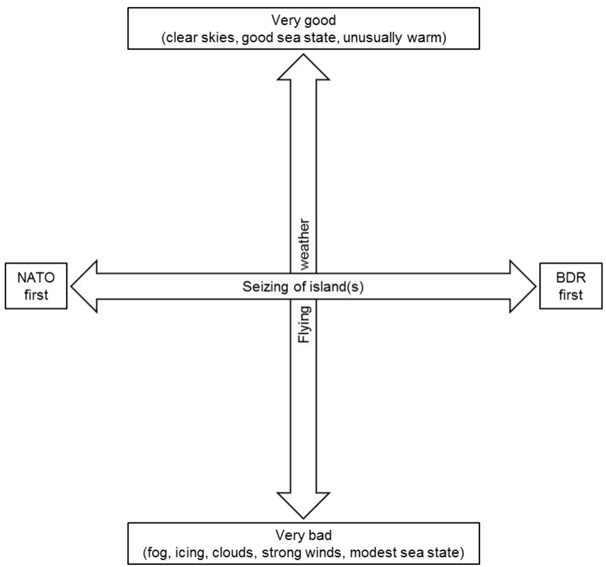  
Figure 18 – Empty futures matrix for one pairing of factors  

Step 5: Generate narratives. The next stage of the futures exercise involved a wider group than was used during the brainstorming phase, encompassing more possible views. They met for one hour led by the AltA facilitator with the futures matrix on a whiteboard and distributed to each participant on paper. Moreover, two scribes recorded the inputs which the AltA facilitator also added onto the whiteboard as the discussion proceeded. Then the AltA facilitator began describing the situation of the top right quadrant of Figure 18 to the participants. That is, BDR launched its invasion of the Estonian island prior to the arrival of NATO forces and was able to take control. Good weather further permitted a rapid insertion of forces by both sea and helicopter-borne forces. Afterwards, BDR rapidly established anti-aircraft defences on the newly seized territory.  

The session proceeded with various members contributing ideas on what the future could look like. When necessary, the AltA facilitator stimulated discussions by for example suggesting that BDR is now rounding up Estonian civilians and shipping them to Bothnia for release. This is affecting the demographic mix of the island to a point where a pro-Bothnian majority will exist.  

After the group had discussed this particular alternative future in sufficient detail, they moved on to the next quadrant. See Figure 19 for a simplified depiction of the outcomes for all four futures.  

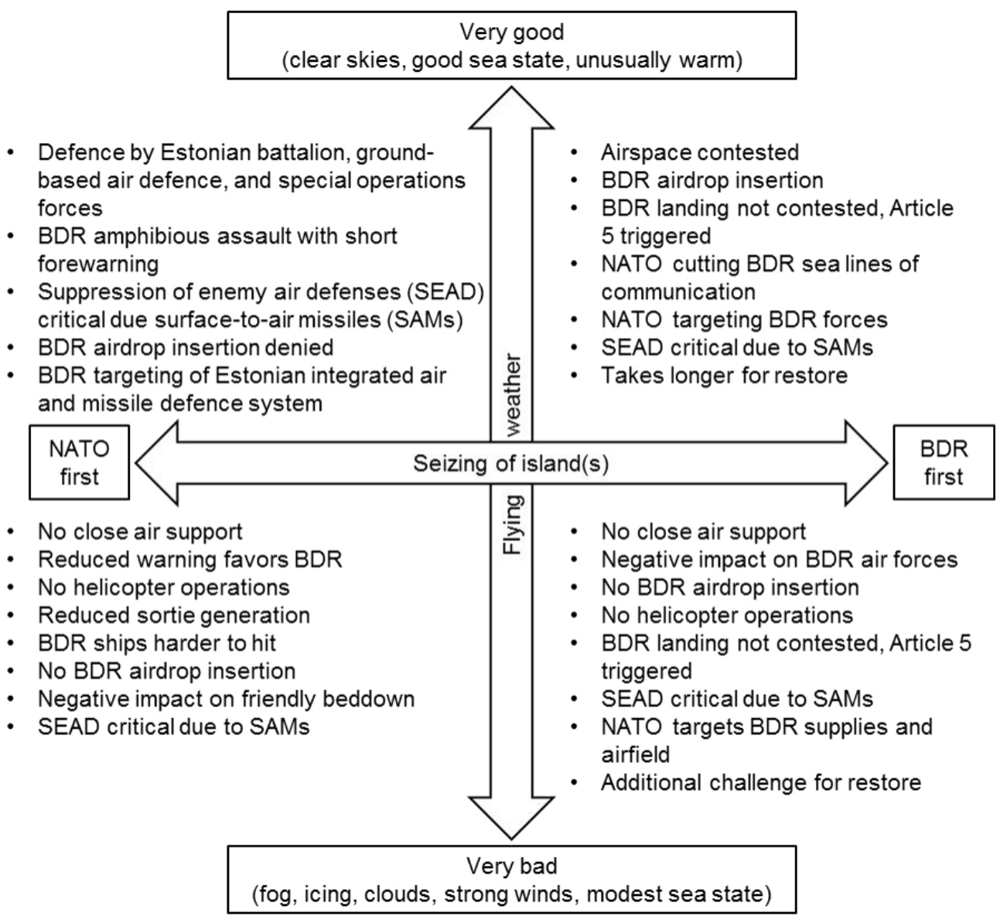  
Figure 19 – Futures matrix with alternatives futures  

Step 6: Evaluate. A review of the matrix identified the following themes that were common to most future views or were key issues:  

SEAD is critical to all versions and is required early;   
 aircraft routine maintenance needs special attention to avoid single points of failure; poor weather negatively impacts force multipliers.  

The planners decided that these points required additional deliberation. After that, they repeated the same process for the second futures matrix.  

In the end, the problem owner and the participants were very satisfied with the replacement of a traditional procedural war game by an AltA technique. The feedback received focussed on the reduction of time and staff resources required to war game and the enhanced situational awareness and achieved understanding.  

# Benefits  

Alternative Futures:  

 checks the resilience of your plan by forcing you to challenge assumptions and contemplate possible wild cards or irregular events. provides an effective means to weight multiple unknowns and to present sets of possible outcomes.   
 generates indicators to monitor developments and assess trends.   
 creates a broad framework to reflect upon costs, risks, and opportunities.   
· bounds a problem by identifying plausible combinations of uncertain factors. harnesses the participants’ abilities to imagine different futures by enabling them to assume the role of both supporting and opposing elements, thus avoiding adversarial roles.  

# Challenges  

Alternative Futures:  

 amounts to a considerable investment in time, resources, and money for elaborate problems.   
 necessitates an AltA facilitator in order to keep the group concentrated on the focus issue. This prevents its members from wandering too far off or becoming entrenched in dogmatic positions.   
 calls for a diverse group encompassing many types of expertise to conduct the futures work. In addition, you have to ensure they feel empowered to share their ideas in a freewheeling discussion. requires the problem owner to recognize the high degree of uncertainty surrounding the focus issue and to accept the free thinking involved in the analysis.  

# Hints and tips  

 Make sure that the axes reflect only factors beyond your control. So do not look for example at how much strength friendly forces should use or the influence of the available budget’s spending rate. These are unknown because your own leaders have yet to take a decision. Alternative futures analysis needs to focus on the uncontrollable effects of the environment, opponents, or the market place, not on secondguessing your superiors. Explore a range of outcomes rather than letting yourself be drawn to any preconceived result.  

Involve decision makers in the process to effectively communicate the results of the analysis, hence sensitizing them to key uncertainties and issues. This process of developing scenarios is as useful for them as a final product that captures the study’s results. Furthermore, their vision regarding key time periods or conditions to explore can greatly assist you in defining revealing futures matrices to work on. Even so, they need to be sparing with their opinions to avoid biasing the group consensus towards their view.  

# Further reading  

Center for the Study of Intelligence (US). A tradecraft primer: structured analytic techniques for improving intelligence analysis. Washington, D.C.: Central Intelligence Agency; 2009 Mar.   
 Development, Concepts and Doctrine Centre. Red teaming guide. 2nd ed. Shrivenham (UK): Ministry of Defence; 2013 Jan.  

# Devil’s Advocacy  

(for 2–10 or more than 10 people; easy)  

A technique that allows an individual or a team to become the critic of a proposed solution, decision, or key assumption. In general, it challenges a single, strongly held view regarding a critically important subject by building the best possible case for an alternative explanation.  

# What to use it for  

 challenging a consensus or key assumption and examining doubts on a widely held view making a plan more resilient   
· strengthening a decision against close scrutiny   
. validating assumptions reaffirming your confidence in judgments made on an important issue  

# Application  

Step 1: Assign a devil’s advocate. This can be an individual or a group of people. They should have critical thinking and reasoning skills as their role is to find flaws in an argument.  

Step 2: Evaluate main line of thinking. If you are the assigned devil’s advocate, analyse the main line of reasoning the group has developed. Also try to understand what the key underpinning assumptions and the supporting evidence are; record your findings accordingly.  

Step 3: Review evidence. Select an assumption that appears susceptible to challenge. Now review the evidence to determine whether any of it is of questionable validity. Additionally, assess whether deception is possibly at play or whether major gaps in knowledge exist.  

Step 4: Highlight contradictions. Check evidence that may support an alternative hypothesis, decision, or position, and draw attention to where exactly it contradicts the current thinking.  

Step 5: Present outcomes. Show the group your results that demonstrate flawed assumptions, poor quality evidence, or possible deception at work. Afterwards, discuss these with the other group members.  

# Example  

The Devil’s advocate technique is regularly applied in the NATO Defence Planning process in order to challenge assumptions and check the supporting evidence base before decisions are made.  

# Benefits  

Devil’s advocacy:  

highlights weaknesses in thinking or alternatively helps to reaffirm confidence in prevailing judgements.   
 identifies any faulty logic or information that would undermine critical assessments.   
 uncovers previously unrecognized assumptions. improves the number and quality of generated strategic alternatives. expands a decision maker’s view of the problem and weakens the narrowing influence of expert recommendations. prevents groupthink and increases the chance of high-quality decisions.  

# Challenges  

Devil’s advocacy:  

prevents productivity when the devil’s advocate position is taken to an extreme by constantly disagreeing and arguing just to argue. imperils solidifying a commitment to a disastrous plan by convincing you that you considered all viewpoints and arrived at the decision rationally and objectively.  

# Hints and tips  

For AltA facilitators:  

 Reflect upon an individual’s or groups’ personal attributes when appointing the devil’s advocate. These must be self-confident, independent persons able to take the opposite viewpoint for an argument’s sake and whose opinion the rest of the group respects. They may have a natural talent in challenging opinions.   
 Provide name tags/cards that clearly identify their bearers as devil’s advocates.  

For devil’s advocates:  

 Remember that “the neatest trick of the devil is to persuade you that he does not exist”27. So keep your tone positive and encouraging even while challenging someone’s position. Also try to emphasize that your goal is to address the same problem and not just to shoot down an idea.  

 Maintain optimism, and always embrace politeness; also reject the idea that anger and contrarian are the same thing.  

Watch your body language, i.e. maintain welcoming eye contact and open postures.   
 Ask tough questions, request elaborations or examples, propose alternative definitions, and make challenging statements without threatening. Above all, attack ideas and not people.   
 Consider drafting a separate contrarian paper that lays out the arguments for a different conclusion in case you discovered sufficient flaws. Ensure that any such product clearly presents the conventional wisdom and that you identify it explicitly as a devil’s-advocate piece of work. Otherwise, you risk the reader becoming confused as to the current official view on the problem.  

# Further reading  

 Schwenk CR. The use of devil’s advocates in strategic decision-making. [Champaign]: University of Illinois at Urbana-Champaign, Bureau of Economic and Business Research; 1984 Apr. (Faculty working paper No. 1036). Center for the Study of Intelligence (US). A tradecraft primer: structured analytic techniques for improving intelligence analysis. Washington, D.C.: Central Intelligence Agency; 2009 Mar.  

# Team A/Team B Analysis  

(for 2–10 or more than 10 people; medium)  

A technique that employs separate teams who contrast two or more strongly held views or competing hypotheses. Team A/team B analysis centres on reducing friction and narrowing differences through focused and evidence-based arguments.  

# What to use it for  

resolving a longstanding strategic issue  scrutinizing a critical decision with far reaching implications before its implementation handling a dispute within a community that has obstructed effective cooperation  

# Application  

Phase A: Analyse positions.  

Step 1: Identify competing views. Identify two competing hypotheses or views regarding a topic or decision to be made.  

Step 2: Form teams. Assemble two groups, and assign a different competing hypothesis or viewpoint to each of them. Then task them to develop the best case possible for their standpoint.  

Step 3: Review information. Ask the teams to evaluate all pertinent data that supports their respective positions and to identify missing gaps that would otherwise strengthen their hypothesis. In addition, encourage them to use brainstorming (see page 31) or starbursting (see page 45) to facilitate this step.  

Step 4: Structure arguments. Let the groups establish lines of reasoning for their viewpoint. For this purpose, advise them to create for each argument an explicit presentation of assumptions and evidence as well as a careful articulation of the underlying logic.  

Phase B: Debate positions.  

Step 5: Establish jury. Form an independent jury as an impartial panel capable of drawing a conclusion. Jury members should preferably hold a neutral position towards the topic.  

Step 6: Present findings. Allocate to each team a time to display the findings that support their hypothesis. Also allow the jury to question the teams regarding their assumptions, evidence, or logic during this presentation.  

Step 7: Challenge and defend. Give each team the chance to contest the other teams’ arguments and to defend themselves against their opponents’ critique. Importantly, ensure fairness and prevent dysfunctional behaviours, which most likely occur at this step.  

Step 8: Make recommendations. Grant the jury time to consider the strength of each presentation and to recommend subsequent steps for further research.  

# Example  

SHAPE’s command group tasked a working group to assess the potential future status of one of NATO’s commands. Moreover, they should also recommend one course of action for further implementation. So the working group applied the team A/team B technique to compare different proposals.  

Phase A: Analyse positions.  

Step 1: Identify competing views. The working group identified the following two hypotheses:  

the command in question should remain a memorandum of understanding (hypothesis A); the command in question should be incorporated into the NATO Command Structure (hypothesis B).  

Step 2: Form teams. Each of the two teams formed comprised about 15 people and attended to one of the above hypotheses.  

Step 3: Review information. The team members received background information a few days in advance of the debate phase. The intention was that this would facilitate data evaluation and assessment prior to conducting the technique. Both teams had access to an AltA facilitator and applied creative AltA techniques to build their positions. Furthermore, subject-matter experts were made available and provided the necessary information to the teams.  

Step 4: Structure arguments. Next, the AltA facilitator brought the teams together and asked them to finalize their arguments. There, team A used the funding available from the framework nations as their main argument. Team B meanwhile focused on the increased visibility of the command as part of the NATO Command Structure.  

Phase B: Debate positions.  

Step 5: Establish jury. Staff members not involved in the project formed the jury. They were joined by the project lead responsible to deliver the recommendation to the command group.  

Step 6: Present findings. Each team had 45 minutes to present their arguments in front of the jury.  

Step 7: Challenge and defend. In the following, the AltA facilitator gave ten minutes to each team to contest the other’s view. After that, they had ten minutes to defend their position against the objections raised. Given the sensitivity of the issue, the AltA facilitator imposed strict timings.  

Step 8: Make recommendations. Thereafter, the jury assessed the arguments of each team and finally recommended hypothesis A. COS SHAPE eventually approved the chosen course of action in a subsequent briefing and endorsed it for implementation as the future status of the command.  

# Benefits  

Team A/team B analysis:  

aids you in judging each position’s merits and in reaching an independent conclusion on the strongest argument by exposing key assumptions and information used. surfaces and explains important differences in views to decision makers. They clearly learn more by weighing well-argued conflicting standpoints than by a point paper masking substantive differences or presenting the lowest common denominator. demonstrates to opposing experts the value of the other groups’ perspectives. reduces friction and narrows differences, thus allowing people holding opposing views to feel that their opinions have been given equal attention.  

# Challenges  

Team A/team B analysis:  

requires an experienced AltA facilitator during the debate phase if the teams very strongly hold conflicting standpoints.  necessitates clear guidelines for the teams on what is expected.  

# Hints and tips  

 Be prepared to handle strongly opposed views and dysfunctional behaviour. Anticipate unexpected outcomes when using external experts to form one of the teams. Place participants on teams advocating positions they do not normally support if these opposing standpoints are well established. This forces them to argue for the other team and hence makes them aware of their own mindset. Assign and enforce strict time limits during the debate phase to overcome unintentional bias.   
 Search on the Internet for “how to debate” or “debating skills” if you need ideas on presenting a team’s findings during the debate phase.  

# Further reading  

 Reich RC. Re-examining the team A-team B exercise. International Journal of Intelligence and CounterIntelligence. 1989;3(3):387–403. Center for the Study of Intelligence (US). A tradecraft primer: structured analytic techniques for improving intelligence analysis. Washington, D.C.: Central Intelligence Agency; 2009 Mar.  

# Pre-Mortem Analysis  

(for individual or 2–10 people; medium)  

A technique that applies mental simulation to explain why a plan or project might fail, highlighting risks to be monitored and managed. Pre-mortem analysis aims to reduce the risk of surprise and the subsequent need for a painful post-mortem investigation of what went wrong.  

# What to use it for  

planning operations checking an action plan before taking a final decision validating a project plan before implementation  

# Application  

Step 1: Familiarize with plan. Make sure the participants are already familiar with the plan being analysed by giving them sufficient time and material to prepare. Then introduce the plan to the team in a round-table session and specify areas of it to be tested in the pre-mortem analysis.  

Step 2: Set up challenge. Dare the group to imagine a fiasco: Fast-forward into the future, the plan has failed, a total, embarrassing disaster. Then ask what could have caused this.  

Step 3: Generate reasons for failure. Employ e.g. brainstorming (see page 31) or brainwriting (see page 40) to find answers to this question. Also ensure the reasons are recorded so that by the end of this step you have a comprehensive list of concerns with the plan.  

Step 4: Cross-check against plan. Re-visit the initial plan using the comprehensive list of concerns to determine any risks to mitigate. You may want to begin developing potential branch plans at this point. As time permits, consider conducting a second round of questioning to review the updated plan.  

Step 5: Periodically review list. Repeat this evaluation during the planning process and its execution to keep the possibility of different types of failure fresh in everyone’s mind.  

# Example  

NATO decided to conduct a pre-mortem analysis during the operations planning for exercise STEADFAST JAZZ 13. Since about 60 people attended the event, the AltA facilitator decided to run the analysis based on a questionnaire to best benefit from each participant’s experience.  

Step 1: Familiarize with plan. The AltA facilitator began the analysis by explaining the objective of the pre-mortem analysis to the planners in a plenary session. At this moment, the planners were already familiar with the operational plan in the exercise.  

Step 2: Set up challenge. Now, the participants received the following questionnaire the AltA facilitator had prepared beforehand:  

# Pre-mortem analysis  

Date:  

Imagine that the plan/course of action on which you have worked has been implemented as planned, and has turned out to be a complete failure. Ignoring acts of God, e.g. a meteorite vaporizing Blue forces, what would you think would be the primary cause of the failure? Please describe the cause below.  

Your input to this task is anonymous, so please be frank about any concerns you have for the plan.  

Please return when completed into the drop-off box provided at XY.  

The questionnaire further contained space for the planners’ comments. Moreover, the AltA facilitator set a deadline of 24 hours for the replies to be submitted.  

Step 3: Generate reasons for failure. The collection box was located in an open area for the participants to drop off their completed forms. After the expiration of the deadline, the AltA facilitator had collected a total of 33 replies. Next, they collated them together and categorized the information to identify common threads and key themes. This action also intended to recognize “off-the-wall” inputs which could help to identify problems while there was still time to pre-plan corrective action. In addition, the AltA facilitator annotated a plus sign to each subsequent version of the same problem in order to capture its frequency. Table 26 lists part of the information received.  

Table 26 – Pre-mortem input received broken down by category   

<html><body><table><tr><td>Category</td><td colspan="2">Concern</td></tr><tr><td colspan="2">Assessment of regional·</td><td>AsymmetricattacksonNATOForces(NIMFOR)+</td></tr><tr><td colspan="2">situation ·</td><td>Deterrence needs B1/B52's; might not be available</td></tr><tr><td colspan="2"></td><td>Lack of full commitment by nations to NIMFOR</td></tr><tr><td colspan="2"></td><td>Lack offullreview of situation in theatre++</td></tr><tr><td colspan="2">Planning methods</td><td>Low political commitment</td></tr><tr><td colspan="2"></td><td>Lack of land component command (LCC)/maritime component command (McC) planners in support</td></tr><tr><td colspan="2"></td><td>Lack of preparation for casualties/body bags</td></tr><tr><td colspan="2"></td><td>Lack of trained planners</td></tr><tr><td colspan="2"></td><td>Poor operations design +</td></tr><tr><td colspan="2"></td><td>Spenttoolongonthedetailsoftheplan</td></tr><tr><td colspan="2">Maritime shipping·</td><td> Impact of piracy onto sea lines of communication (SLOCs) leads</td></tr><tr><td colspan="2">routes</td><td>to poor resupply</td></tr><tr><td colspan="2"></td><td>Loss of Osman sea ports of debarkation (SPODs) +</td></tr><tr><td colspan="2"></td><td>Surface-to-surface missiles (SSMs) against ships close SLOCs</td></tr></table></body></html>  

# Shortage of resources  

 Insufficient MCC carrier air assets Lack of NIMFOR assets if simultaneous attack $+{+}{+}{+}{+}$   
 Lack of sufficient standoff weapons $^+$ Too few air-to-air refuelling assets  

Step 4: Cross-check against plan. A small team including the problem owner assessed the themes’ validity and importance before conducting a wider plenary meeting to discuss and review the concerns. Teams of planners then received the task to review the plan and recommend corrections to prevent a failure caused by the critical issues identified. Refer to Table 27 for a tabulated short list of top problems together with a list of remedial actions identified for follow-up.  

Table 27 – Identified failure causes and refinements   

<html><body><table><tr><td>Failure causes - pre-mortem views</td><td colspan="2">Refinementsforplan</td></tr><tr><td></td><td>CoordinatedSTE/KAMattack</td><td>Ensurethatcoursesofactioncandealwith simultaneous/coordinatedSTE/KAMattack</td></tr><tr><td></td><td>LackofNIMFORassets Fuel supply, logistic support, dependency on</td><td>includingsufficientassets Improveoperationsdesign,e.g.haveasepa</td></tr><tr><td></td><td>RedSeaairroutesandSLOCs Lack of understanding of the theatre situation Poor coordination withLCC,leading tofratri-</td><td>rate air designwith own objectives and "stepping stones" Protection of Osman SPODs, keeping the</td></tr><tr><td></td><td>cide</td><td>harbour open Reduce dependency onRed Sea airroutes</td></tr><tr><td></td><td></td><td>and SLOCs</td></tr><tr><td></td><td></td><td>Robustness of logistic support and fuel sup- plysystem</td></tr><tr><td></td><td></td><td>Increase understanding of the theatre situa-</td></tr><tr><td></td><td></td><td>tion</td></tr></table></body></html>  

Step 5: Periodically review list. In the aftermath, the planners reviewed the list of concerns and refinements throughout the planning process.  

# Benefits  

Pre-mortem analysis:  

highlights the right things to worry about early in the project. empowers you to question the premise of assumptions, specified tasks, or a proposed course of action during the operations planning process. prevents overconfidence in your plans by making you aware of the nature and scope of any risk which you knowingly take. brings forth doubts that participants have withheld during the various planning stages due to group pressure and the desire to conform.  is both simple to use and straightforward to understand.  

# Challenges  

Pre-mortem analysis:  

calls for a diverse group of planners encompassing many types of expertise and ensuring that they feel empowered to share their ideas.   
demands criticism of the plan to be taken in a constructive way to isolate and eliminate possible weaknesses. risks wandering too far off from the identified problems or becoming entrenched in dogmatic positions at the review stage.  

# Hints and tips  

 Use pre-mortem analysis ideally just before a wargaming step in an operations planning context. This could be either a war game examining proposed courses of actions or one refining the selected course of action into the operation’s concept. Create an artificial news headline to simulate the failure of the plan. Test out the formulated question with a focus group to ensure the wording is as clear as possible to minimize spoiled returns or irrelevant comments. In addition, emphasize the need to focus on problems you have the power to mitigate. Reassure participants of the anonymity of their inputs when using the questionnaire method. This way they can criticize any element of the plan, planning, or leadership without fearing adverse consequences.   
 Identify any suggested “black swan” events28. This could trigger a separate requirement to e.g. conduct an alternative futures analysis (see page 85).  

# Further reading  

Heuer RJ Jr, Pherson RH. Structured analytic techniques for intelligence analysis. 2nd ed. Los Angeles: CQ Press; c2015.   
Klein G. Performing a project premortem. Harvard Business Review. 2007 Sep;85(9):18–9.  

# What-If Analysis  

(for individual or 2–10 people; hard)  

A technique that assumes an event resulting in a negative or positive outcome has occurred and explores possible explanations how it might have come about. In general, it shifts the focus from whether an event could occur to how it may happen. Contrary to pre-mortem analysis (see page 97), this method tries to analyse trends and to develop signposts towards future events instead of finding explicit reasons for a potential failure.  

# What to use it for  

 identifying the key stakeholders in case of and the issues to address prior to such an event occurring understanding how an event may come around in the future   
. confronting a confidently made forecast that may not be clearly justified questioning a strong mindset that an event may not take place as planned  

# Application  

Step 1: Define event. Agree on the scenario you want to study and contemplate what the world would look like if it has happened. Now develop a statement that simply describes the envisaged situation.  

Step 2: Identify triggering incidents. Apply brainstorming (see page 31) to identify all possible incidents that permitted the event to unfold through a causal chain of other incidents.  

Step 3: Examine plausible pathways. Identify one or more plausible routes to the event using the triggering incidents identified in the preceding step. Next, draw links and relationships between them to recognize the multiple pathways along which the scenario may develop. Work then backwards from the event in concrete ways, and specify what must actually occur at each stage of the scenario to support this step.  

Step 4: Develop arguments. Develop a line of reasoning for each pathway based on facts, logic, and evidence to explain how the event may become possible. Afterwards, contemplate the scope of each incident’s positive and negative consequences and their relative impacts.  

Step 5: Generate indicators. Create a list of signposts that would help you detect the beginning of the event and signals that it is evolving along a potential pathway.  

Step 6: Monitor indicators. Observe these indicators on a periodic basis, and make a thorough assessment of the situation.  

# Example  

As a fictitious example, consider the following event:  

Positania is often portrayed as a corrupt nation in many reports, surveys, and opinion articles. But the Positanian government wants to eradicate this stain of corruption. Interna  

tional forces agree to assist the government. But the presence of the international coalition contributes to Positanian corruption. Corruption thrives not in spite of international forces’ efforts, but because of them.  

The statement to the situation described above is: International forces are perceived to be corrupting Positania. Figure 20 visualizes possible triggering incidents and plausible pathways to the event.  

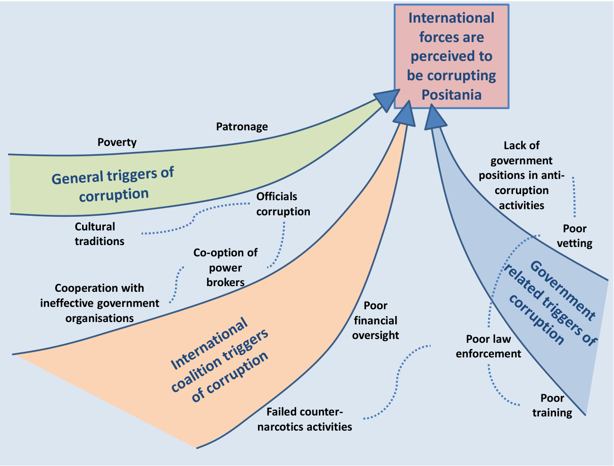  
Figure 20 – Incidents and pathways to corruption in Positania  

In a next step, you would create lines of reasoning as well as indicators for these pathways.  

# Benefits  

What-if analysis:  

 frees you from arguing about the probability of an event and considers its causes. explores potential factors that could cause or alter an event if judgement rests on limited information or unproven assumptions.   
 develops indicators of an event’s possible emergence in order to prepare action.  

identifies appropriate safeguards required to protect against potential problems in the future.  

# Challenges  

What-if analysis:  

can produce highly sensitive results, particularly by highlighting capability gaps or weaknesses in plans. attempts to predict the future before it happens and therefore possesses a high degree of uncertainty in its results.   
consumes a lot of time during scenario development.  

# Hints and tips  

 Use creative AltA techniques (see page 31ff.) to facilitate steps 2 and 3.  Create storylines for the pathways leading to the envisaged event to visualize your findings.  

# Further reading  

 Mitchell DJ, Russo JE, Pennington N. Back to the future: temporal perspective in the explanation of events. Journal of Behavioral Decision Making. 1989 Jan;2(1):25–38.   
 Center for the Study of Intelligence (US). A tradecraft primer: structured analytic techniques for improving intelligence analysis. Washington, D.C.: Central Intelligence Agency; 2009 Mar.  

This page is intentionally left blank.  

# Part 3 AltA Facilitation  

This page is intentionally left blank.  

# 1 Facilitation Introduction  

Many AltA techniques benefit from an experienced facilitator in order to improve outcomes and to ensure the techniques are applied correctly. The AltA training course at NATO School Oberammergau teaches the basics of facilitation; however, it is a skill which some people possess naturally and others will have to work at. More advanced facilitation training is therefore beneficial.  

AltA facilitators assist in the process of creation without themselves being the producer of the end result. Generally speaking, the process of facilitation is  

“a highly structured meeting in which the meeting leader (the facilitator) guides the participants through a series of predefined steps to arrive at a result that is created, understood, and accepted by all participants.”29  

Group facilitation is an art and a skill, a science and an intuition. Its aim is to build a team that is excited, committed, and focussed on getting an answer to a problem. Consequently, the problem owner should consider using an AltA facilitator whenever AltA techniques are applied in a large and formal workshop setting.  

The key elements of facilitation fall in line with the AltA process. This part provides hints and tips which lay mainly in the preparation and application stages of AltA, as outlines below.  

Facilitation preparation:  

5 Ps   
setting up the room   
setting the agenda   
ground rules   
parking lot  

Facilitation application:  

getting the group started   
asking questions   
using the pen   
maintaining the energy of the group   
managing personalities   
building consensus   
closing the session  

This page is intentionally left blank.  

# 2 Facilitation Preparation  

# 5 Ps of Preparation  

The work of an AltA facilitator starts well before the workshop. Preparation is a key element for success, and the steps in Part 1 of this handbook must be followed closely.  

There, we described the 5Ps of preparation. The following list30 describes each in a little more detail:  

 Purpose. Why are you holding the session? What is the key problem and what are the key objectives? Product. What do you need to have when you are done? How will you know you have been successful? What are the criteria for success? Participants. Who needs to be involved, and what are their perspectives? What are the skills, competencies, and experience that are needed within the group to succeed? Probable issues. What are the concerns that will likely arise? What are the “gotchas” that could prevent you from creating the product and achieving the purpose?   
 Process. What steps should you take during the meeting to achieve the purpose, given the product desired, the participants, and the probable issues that you will face? How are you going to implement any outcomes from the session?  

If you plan to use a specific AltA technique, do not forget to review/study it to ensure you understand how to lead the group through its application.  

Most of the success of a facilitation session is based on the preparation phase. Clearly identify the above elements before you start. Then you will have a much better chance of keeping the discussions on track and delivering the intended product at the end.  

# Setting up the Room  

As an AltA facilitator, you should view the location of the workshop in advance to understand any space limitations and the facilities available. On the day of the workshop, arrive at least 30 minutes before the participants to set up flip charts, whiteboards etc. Also consider pre-filling any flip charts or whiteboards with the ground rules for the session, the agenda, and a parking lot (see following).  

# Setting the Agenda  

The agenda should be formulated in advance and take into account the time required to warm up the group, to complete the AltA technique, to close, and to have breaks as appropriate. Consider a 20 minutes break at least every 90 minutes to maintain people’s energy levels.  

Write the agenda on a flip chart, primarily to explain it to the group. But it also acts as a constant reminder of what stage the group is in the process, how much work is left to be done, and consequently what progress is being made.  

# Ground Rules  

Ground rules are a useful tool to set out expectations at the start of the session. They are also invaluable if encountering dysfunctional behaviour later on in the session. A word of caution, however: Any rules that are established have to be agreed on and accepted by all in the group. The AltA facilitator can prepare ground rules in advance, but must change or add to them if the group wishes. The box in Figure 21 contains some suggested ground rules; pick no more than five for any single workshop.  

# Example ground rules for AltA facilitated sessions (pick three to five from list)  

Sessions start on time, there will be no review for latecomers.  

Agenda times are flexible, we will get as far as we get.   
Or: Agenda times are fixed, even if we have to curtail discussions.   
Stay in the room when class is in session.   
It is OK to move around if you feel like it.   
No distractions: no checking email/reading papers.   
It is OK to have fun.   
Breaks will be taken when the group lead says so/when the group decides.   
Constructive feedback only.   
This is not problem-solving, but learning how to solve problems.   
All ideas are to be considered.   
People need not agree.   
Suspend predetermined positions to allow the collective intelligence emerge.   
Say what you mean and mean what you say.   
No sarcasm or other put-downs.   
Monitor your level of participation (too much, or too little?) for the good of the group.   
Write legibly so others can read it.   
Always look up (be positive).   
Keep an open mind.   
Strive for results.   
One person talks at a time, to the whole group.   
All questions to be answered seriously.   
Record outputs on flip charts.   
Listen to each other, and learn from the group.   
No negative statements, only questions (e.g. not “this is stupid”, but “how do we make it better?”).  

# Parking lot  

A parking lot is a blank flip chart or whiteboard space that can be filled during the session. It is a place for topics and questions that the AltA facilitator, for whatever reason, does not want to discuss at the time they are raised during the workshop. This is a useful tool for stopping discussions going down rabbit holes and to help the group focus on the important task at hand. Saying “lets park that for later” means the topic or question will be captured and not forgotten whilst paving the way for the discussion to move onto something more productive. However, the AltA facilitator must leave time at the end of the session to revisit the parking lot to ensure no burning issues are left undiscussed.  

This page is intentionally left blank.  

# 3 Facilitation Application  

The following are hints and tips to consider when applying the AltA technique as a facilitator.  

# Getting the Group Started  

The team members gathered in the room at the start of the session may not fully understand why they are present or may be resistant to the use of “unconventional” AltA techniques. Hence, one important step will be to get the participants sufficiently enthusiastic about their task so they can profit from the benefits of group dynamics.  

It is suggested that you allocate about 15 minutes to explain the agenda, any ground rules or parking lot, and the aim and objectives of the session. Consider how to make your impression and get the team excited and involved with the task in hand. You may make it personal – explain how they will be affected by the result of the session. Or maybe court a little controversy to challenge people’s perceptions.  

One important thing is to get everyone comfortable with expressing their opinions. Consider starting the session with an icebreaker or simply by asking everyone to share their expertise on or interest in the topic – not only is this useful information, but it gets everyone to talk at least once (and therefore get comfortable with talking).  

# Asking Questions  

The preparation of an overarching “key question” for the AltA session is important for nearly all techniques. Consider posting this question on the wall as a reminder.  

During the workshop, asking questions is the AltA facilitator’s main tool for driving discussion without imposing their opinion on the group. Principally, you can distinguish two types of questions to use within a facilitated session: closed questions and open questions. You ask the former by providing answers from which to choose, while the latter require respondents to deliver answers in their own words. To ease understanding, consider the examples in Table 28.  

Table 28 – Examples of closed and open questions   

<html><body><table><tr><td>Closedquestions</td><td>Openquestions</td></tr><tr><td></td><td>Is the damage caused by water ingress?</td></tr><tr><td>Do you know why this has happened?</td><td>How many alternatives can you think of?</td></tr><tr><td>Are you responsible for this?</td><td>When did thishappen?</td></tr></table></body></html>  

The success of your facilitation depends fundamentally on you starting with the right type of questions – namely, open ones. After all, you want to “paint a picture” and inspire wider thinking instead of shutting down creativity by asking closed questions. But since open questions require inevitably more effort to come up with, make sure to prepare the initial questions in advance.  

# Using the Pen  

AltA facilitated sessions revolve around whiteboards, flip charts, sticky notes, and pens. The person with the pen wields immense power and needs to take great care of how to use it. It is an easy trap to fall into to write down your interpretation of what you heard, which is different to what was actually said and what the group member meant. Keep your writing clear and legible so that people can correct your misinterpretations. Also ask for confirmation or clarification if you are not sure what to write down. Equally important is capturing all views; not writing down someone’s idea is a quick way to turn that person into a silent participant. Record as much as possible, even the crazy ideas and those that you do not personally agree with. If the idea contains lots of words, ask the person who originated the idea to create a headline that describes it in a concise way.  

# Maintaining the Energy of the Group  

# Setting the pace and keeping it going  

As a good AltA facilitator, you do not want your team to burn out too soon when you have still much to do. Expect lulls during the session, too. But you can manage these challenges by careful agenda preparation and the use of checkpoints to set the pace. Thus, if one element of the discussion is drying up, be prepared to move on to another one. Alternatively, consider a viewpoint on the element different from the one which had been used until then.  

For example, if you are brainstorming and it does not seem to go well, think about turning it around and doing a reverse brainstorming instead. This may just free up the creativity that has been blocked. After all, you can always return to the original intent later. The trick is to keep the team excited by their work, so they want to contribute to the outcomes. Remember to spot the lull coming and to take action before it happens.  

# Encouragement and motivation  

More than anything else, you need to be able to encourage and motivate the team that is in front of you. Understanding the team is fundamental to this, as a misplaced action or comment can completely destroy any further creativity. You also have to have the energy to carry the team along with you on what may often be long days.  

Think about the way that you use your voice. Remember to speak and enunciate clearly, emphasizing key words and phrases. Slow your speech down, get the arms waving, and move around. If the team does not know where you are going to go next, they may well stay awake long enough to find out and remain engaged in the session.  

Using praise is a valid but tricky technique as you do not want to appear prejudiced. If used, try to spread the praise and encourage agreement from others in the room. Similarly, if elements of the session involve some form of presentation, it is entirely appropriate to have a short period of applause to recognize the effort that the presenter has made.  

In a long session, think about how you will deal with the inevitable drops in energy, which will typically occur at 10.30, 13.30, and 15.00. However, the overall threat in the early afternoon is very high, particularly if a good lunch has been involved. The only effective way to deal with this is by movement and changing the environment. Your options are to have small group breakouts, to conduct a short team-building exercise, or to carry out some sort of facilitated process that includes movement. Long presentations, reading, or individual exercises should be firmly avoided during these periods.  

# Managing Personalities  

Despite your best planning and preparation, sometimes the facilitated session will not go as expected due to difficult personalities in the room. When facilitating and AltA session, you should have tools available to deal with such a situation.  

# Monitoring body language  

When you interact with others, you continuously give and receive wordless signals. All of this non-verbal behaviour of yours – the gestures you make, the way you sit, how fast or how loud you talk, how close you stand, how much eye contact you make – sends strong messages. These messages do not stop when you stop speaking either. Accordingly, even when you are silent, you are still communicating non-verbally. As an AltA facilitator, you thus need to be very well attuned to the non-verbal communication during the facilitated session.  

Often, what comes out of somebody’s mouth and what they communicate through their body language are two totally different things. When faced with these mixed signals, you have to choose whether to believe the verbal or non-verbal message. In most cases, you should decide on the non-verbal one. This is because it is a natural, unconscious language that broadcasts true feelings and intentions at any given moment.  

# Identifying resistance to change  

People are naturally conservative, and having no intention to change what they do or how they do it, they are often comfortable with the status quo. Therefore, they need to be persuaded of the benefits of a proposed change, probably without them fully understanding all implications of this proposal. As an AltA facilitator, you will hear a multitude of reasons why something will not work, ranging from “we tried that before” through “we have always done it that way” to “it can’t be done” and “not invented here”.  

Individuals resist change for many reasons, but largely because they perceive it as negative or do not want to deal with the causes for its necessity. This resistance will manifest itself in what people say and, often more importantly, in what they do. You must hence be alert in identifying it by watching how people behave and listening carefully to what they say and also what they do not say.  

You can deal with resistance in three fundamental steps:  

Step 1: Identify the form the resistance is taking. Trust what you see more than what you hear, listen to yourself and use your own feelings as a barometer. Also pay attention to repetition/telltale phrases.  

Step 2: Acknowledge and name the resistance. Tell the person your perception of the resistance, but do it in a win-win, neutral, non-aggressive manner, e.g. “What I think I hear you saying is....” Also tell the person how the resistance makes you feel.  

Step 3: Be quiet, listen, and let the person respond. Get the person talking, encourage full expression of the concerns, and gradually uncover the underlying resistance/issue. However, be aware of other forms of resistance surfacing.  

Ideally you would do all that you can to minimize the resistance before having to deal with the implications of it. Thus, be sensitive that many staff officers will initially be uncomfortable with applying some of the AltA techniques. To help you reduce the impact of this problem, a few strategies are listed below:  

 identify the benefits; explain why change is necessary; invite and answer questions – solicit participation and, if possible, early involvement; avoid surprises – overcommunicate; recognize and reward effort;   
 give more feedback than usual to ensure people always know where they stand;   
invite people to think and act creatively.  

There are of course actions you as an AltA facilitator should not do, for example:  

fight the resistance; take it personally; go into more data collection and get obsessed by detail; avoid or collude with the individual; work more with your “allies” rather than the “resistor”; give too many reasons; lose your confidence; expect to have all of the answers;   
 avoid giving bad news; use aggressive or demeaning language;   
 delay or wait just one more day; expect approval, encouragement, support, and affection.  

Above all, remember that most of the time it is not personal.  

# Managing dysfunctional behaviour  

Unmanaged resistance will often give rise to dysfunctional behaviour in the team. This is any activity by a group member that consciously or unconsciously expresses displeasure with the session content or purpose, the facilitation process, or outside factors. Examples of it are given in Figure 22, where this sort of behaviour is plotted on a continuum. Nevertheless, dysfunctional behaviour is a symptom and not a root cause.  

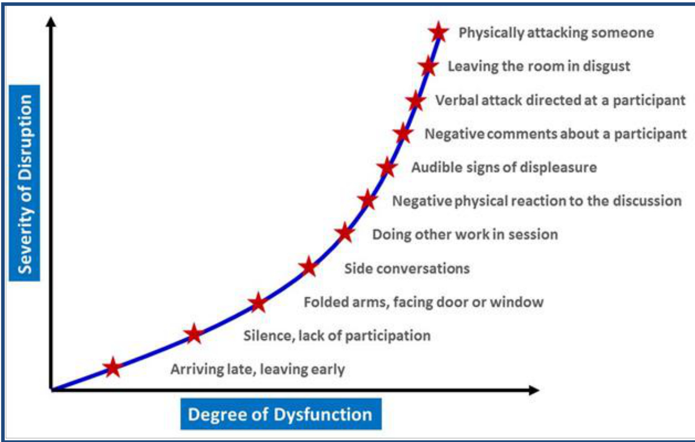  
Figure 22 – Different types of dysfunctional behaviour31  

Be constantly on the lookout for early signs of dysfunction. How you deal with dysfunctional behaviour will vary depending on its nature, when it occurs, the number of people affected, and the probable root cause. Initially, you may want to approach the participant privately, as publicly highlighting their behaviour might inhibit a resolution. Additional recommended steps you can take to help resolve the dysfunction are:  

 empathize with the symptom – express concern about the situation; address the root cause – make an effort to get at the real issue, and ask a question that will yield a response that confirms the issue; get agreement on a solution – depending on what the issue is.  

# Building Consensus  

In an AltA session, you will not only have to facilitate the gathering of information, but also the making of decisions, especially towards the end of the meeting. To give you an  

overview of your options, Table 29 highlights different ways a group can arrive at decisions as well as the advantages and disadvantages of each.  

<html><body><table><tr><td colspan="4">Table 29 - Group decision-making methods</td></tr><tr><td>Method</td><td>Advantages</td><td></td><td>Disadvantages</td></tr><tr><td>Individual</td><td></td><td></td><td></td></tr><tr><td>The leader of the group makes the decision.</td><td>Speed</td><td></td><td>May waste group intelli- gence</td></tr><tr><td></td><td>Simplicity</td><td></td><td>Invites resistance</td></tr><tr><td></td><td>Clarity</td><td></td><td>Lowers motivation for</td></tr><tr><td></td><td></td><td></td><td>participants</td></tr><tr><td>Consultative</td><td></td><td></td><td>Creates messes</td></tr><tr><td>The leader makes a decision after listening to all group</td><td></td><td>Allowsforinputof others without taking undue time</td><td>May cause resentment in those whose advice is</td></tr><tr><td>members in a group meeting.</td><td></td><td>Most cost- and time- effective of all decision</td><td>spurned Loses quality gained from</td></tr><tr><td></td><td>methods</td><td>Guards against group-</td><td>'give and take" and inte- gration of differing pro- posals</td></tr><tr><td></td><td>think Allows for quick action</td><td></td><td></td></tr><tr><td>Consultative Consensus</td><td></td><td>and high levels of action</td><td></td></tr><tr><td>The leader consults with other · group members, seeking</td><td></td><td>Avoids deadlock in deci-</td><td>Time required to attempt</td></tr><tr><td>consensus yet still clearly retaining control of the deci-</td><td>sions Enables leader to lead,</td><td></td><td>consensus "Murkiness" of mixing two</td></tr><tr><td>sion.</td><td>retaining sense of per- sonal control while stil building consensus in</td><td></td><td>decision-making methods May be perceived as ma-</td></tr><tr><td></td><td>group Group members more</td><td></td><td>nipulative</td></tr><tr><td>Modified Consensus</td><td>mentation</td><td></td><td></td></tr><tr><td>The group members agree on a decision that all can support or at least "live with".</td><td>Supports a more demo- cratic, participative culture</td><td></td><td>Time consuming to work through all concerns</td></tr><tr><td></td><td>Forces dealing with all significant conflicting views and opinions in the</td><td></td><td>Compromises are neces- sary, which often do not improve quality</td></tr><tr><td></td><td>group People have belief that it</td><td></td><td>Often tedious to work through the process</td></tr><tr><td></td><td>fostersmore commitment</td><td></td><td>No hard data that this</td></tr><tr><td>Absolute Consensus</td><td></td><td></td><td>method provides more in- telligent results</td></tr><tr><td>All group members believe</td><td>Produces most intelligent</td><td></td><td>Groups fail to achieve</td></tr><tr><td>that the decision is superior to what exists in the status quo.</td><td>ty</td><td>decisions of highest quali-</td><td>decision two out of three times this method is at-</td></tr></table></body></html>  

<html><body><table><tr><td colspan="2">unequivocal</td><td></td><td>May take a very long time, is emotionally diffi- cult and stressful</td></tr><tr><td>Voting Group members vote on al-</td><td>Speed - when handled</td><td></td><td>Creates side and factions,</td></tr><tr><td rowspan="5">ternative proposals, and the alternativereceivingthere- quired number of votes (e.g. majority, two-thirds) becomes</td><td>properly Perceived fairness</td><td></td><td>divides group Encourages debate rather</td></tr><tr><td>Avoids impasses and</td><td></td><td>than dialogue</td></tr><tr><td>deadlocks</td><td></td><td>Detracts from group co- hesion</td></tr><tr><td></td><td>Anyone can lead May be only means pos</td><td>Entrenches people rather</td></tr><tr><td>are irreconcilable</td><td>sible when differences</td><td>than expanding group IQ</td></tr><tr><td></td><td>tool</td><td>Can help build a consen- sus if used as a process</td><td></td></tr></table></body></html>  

# Closing the session  

Once you have arrived at a natural conclusion, either by agenda or by consensus, it is time to review, define, evaluate, end, and debrief the session. Try to get an end product that everybody agrees on – even if you have to wind back to an 80 per cent answer rather than the full solution.  

The final result you are looking for depends on the question set at the start. Maybe you need a set of agreed decisions or a new programme of work. Whatever it was, you need to make sure that something comes out of the day, and that the team feels their efforts have been worthwhile.  

If the output is a set of actions, then make sure each action has a timeline for delivery and that you understand who is going to follow up on the work as it will probably not be the AltA facilitator. Actions need owners and timelines or they become worthless.  

Ensure that you review everything that has been covered. Revisit the parking board, and agree on what is to be done with the items on it. Capture all data that has been presented, and decide together with the team what is going to be done with it.  

This page is intentionally left blank.  

# 4 Desirable Qualities for an AltA Facilitator  

Facilitating a group can yield very valuable results, especially when combined with AltA techniques. In order to succeed as an AltA facilitator as well as to provide alternative views and/or analysis when required, you should strive to develop the following qualities.  

Rationality: Exhibit critical thinking skills; rely on reason rather than emotion; take all known evidence into account; follow evidence where it leads; be more concerned with finding the best explanation than being right, analysing apparent confusion, and asking questions. Self-awareness: Weigh the influences of motives and bias; recognize own assumptions, prejudices, biases, or point of view.   
Honesty: Recognize emotional impulses, selfish motives, nefarious purposes, or other modes of self-deception. Open-mindedness: Evaluate all reasonable inferences; consider a variety of possible viewpoints or perspectives; remain open to alternative interpretations; accept a new explanation, model, or paradigm because it explains the evidence better, is simpler, has fewer inconsistencies, or covers more data; accept new priorities in response to a re-evaluation of the evidence or reassessment of own real interests; do not reject unpopular views out of hand. Discipline: Be precise, meticulous, comprehensive, and exhaustive; resist manipulation and irrational appeals; avoid snap judgments.   
Sound judgment: Recognize the relevance and/or merit of alternative assumptions and perspectives; understand the extent and weight of evidence. Courage: Have the ability and confidence to present – in a constructive manner – potentially unpopular or challenging arguments that go against perceived group norms.  

This page is intentionally left blank.  

# 5 Facilitation Summary  

Facilitating a group is not easy. It takes practice, preparation, confidence, and a degree of innate skill. Although anyone should be able to do it, some people will inevitably be better at facilitating than others. As an AltA facilitator, you must always keep an eye on the end state (and the clock), and you may not always get to the result that you thought you wanted. But as long as the whole team has contributed and you have had the opportunity to give all of the relevant issues a good airing, this should not be deemed a failure.  

Recognize and use the strengths of the team in front of you. Look for the opportunities to engage the quiet ones who might have that vital piece of information that unlocks the whole problem. Likewise, take charge of and guide the loud ones; recognize that they too may have something valuable to give. So do not shut them down, but try and get the information before making room for the others to have their say.  

Maintain the energy of the group. It will go up and down, but if you adjust your programme to the natural rhythms of the day, you can still maximize the output of the team.  

In any session you must constantly balance the process with content, provide an impartial space for group discussions, and deal with dysfunctional behaviour as it occurs. Be patient, non-judgemental, and positive. And always think before speaking; it is far too easy to inadvertently cause offence and destroy the group dynamic.  

Finally, believe in what you are doing and that you can make a difference. Learn from every session that you run, and apply the good bits while avoiding the bad bits in future sessions.  

This page is intentionally left blank.  

The following books, websites, and reports are recommended for those with an interest in AltA.  

Ariely D. Predictably irrational: the hidden forces that shape our decisions. Rev. and expand. ed. New York: Harper Perennial; 2010. Chapter 1. Discusses cognitive biases.  

Bardach E, Patashnik EM. Practical guide for policy analysis: the eightfold path to more effective problem solving. 5th ed. Los Angeles: CQ Press; c2016. Guide to policy review that provides checklist of items to be considered in policy analysis.  

Bazin A, Think: Tools to Build Your Mind.  c2017.  Contains a set of thinking models and methods to improve the way you think, analyse and evaluate.  

Brafman O, Brafman R. Sway: the irresistible pull of irrational behavior. New York: Doubleday; c2008. Chapters 1 and 8. Discusses the forces that influence every aspect of people’s lives including loss aversion diagnosis bias and chameleon effect.  

Brookfield SD. Developing critical thinkers: challenging adults to explore alternative ways of thinking and acting. San Franciso: Jossey-Bass; c1987. Explains the theory behind critical thinking.  

Browne MN, Keeley SM. Asking the right questions: a guide to critical thinking. 8th ed. Upper Saddle River (NJ): Pearson Prentice Hall; c1994–2007. Discusses argument deconstruction and the importance of self-reflection, and deciding what to believe and what to be sceptical of.  

Center for the Study of Intelligence (US). A tradecraft primer: structured analytic techniques for improving intelligence analysis. Washington, D.C.: Central Intelligence Agency; 2009 Mar. Describes some of the AltA techniques, plus other more advanced analytical techniques used in intelligence analysis.  

Development, Concepts and Doctrine Centre. Red teaming guide. 2nd ed. Shrivenham (UK): Ministry of Defence; 2013 Jan.  

Facione PA. Critical thinking: what it is and why it counts. San Jose (CA): Insight Assessment; c1992–2015 [updated 2015]. p. 1–13. What critical thinking consists of and what you should do to effect it.  

Hammond JS, Keeney RL, Raiffa H. Smart choices: a practical guide to making better decisions. Boston: Harvard Business School Press; c1999.  

Harvey, JB. The Abilene paradox and other meditations on management. [San Francisco]: Jossey-Bass; 1996, c1988. Chapter 2. Demonstrates how group dynamics can keep individuals from stating true beliefs.  

Joint Analysis and Lessons Learned Centre. The NATO lessons learned handbook.   
3rd ed. Lisbon: North Atlantic Treaty Organization. 2016 Feb. Klein GA. Sources of power: how people make decisions. Cambridge (MA): MIT Press;   
1999. Chapters 6 and 16. Discusses complexity and systems thinking.  

Kline JA. Listening effectively. Maxwell Air Force Base (AL): Air University Press; 1996 Apr. Subscription required to view. Techniques to aid AltA facilitators in improving their listening skills.  

Rosenhead J, Mingers J., editors. Rational analysis for a problematic world revisited: problem structuring methods for complexity, uncertainty and conflict. 2nd ed. Chichester (UK): John Wiley & Sons; c2001. Analytical methods to assist in problem formulation and problem solving in an uncertain world.  

Russo JE, Schoemaker PJ, with Hittleman M. Winning decisions: getting it right the first time. 1st ed. New York: Currency; 2002 Jan. Chapters 1 and 7. Step by step analyses of how people typically make decisions. Provides worksheets, tools and questionnaires to support getting a big decision made.  

Task Group TG-034. NATO guide for judgement-based operational analysis in defence decision making – analyst-oriented volume: codes of best practice for “soft” operational analysis. Neuilly-sur-Seine: NATO Research and Technology Organization; 2012 Jun. Report No.: RTO-TR-SAS-087.  

Thaler RH, Sunstein CR. Nudge: improving decisions about health, wealth, and happiness. Rev. and expand. ed. New York: Penguin Books; 2009. Chapters 1 and 3. Describes how people make choices, and why they make mistakes.  

University of Foreign Military and Cultural Studies. The applied critical thinking handbook. Version 8.1. [Leavenworth]: United States Army Combined Arms Center; 2016 Sep.  

Wilkinson M. The secrets of facilitation: the SMART guide to getting results with groups.   
New and rev., 2nd ed. San Franciso: Jossey-Bass; c2012.  

http://www.mindtools.com/  

# Alternative Analysis (AltA)  

The deliberate application of independent, critical thought and alternative perspective to improve decision-making  

# AltA facilitator  

A person who supports the application of AltA techniques. The AltA facilitator may work with problem owners directly in executing AltA or may simply advise and guide its use while other staff members perform the analysis.  

# Assumption  

A rational statement believed to be true and designed to represent the truth that is used to drive analytical process in the absence of information. Explicit assumptions are those that are identified and stated in the text. Implicit assumptions are made unconsciously and may be long-held and unchallenged.  

# Bias  

Distortion of thinking and perceptions that can lead to false assumptions and flawed analysis.  

# Challenge technique  

An AltA technique that serves to understand the problem from a different, often opposing, view. This helps in the problem definition process and is valuable during the development of solutions and in the evaluation of courses of action during the decision-making process.  

# Diagnostic technique  

An AltA technique that supports problem definition and problem analysis through the inclusion of the wider problem space and surrounding variables. Furthermore, diagnostic techniques are used to develop alternative perspectives in order to evaluate multiple courses of action.  

# Creative technique  

An AltA technique that helps to understand the complete problem environment, to define the problem, and to develop new or innovative solutions to it. This technique is critical in the beginning of most tasks.  

Critical thinking  

An intellectually disciplined process of actively and skilfully conceptualizing, applying, analysing, synthesizing, and/or evaluating information gathered from observation, experience, reflection, reasoning, or communication as a guide to belief and action.  

# Groupthink  

The desire for solidarity or unanimity within a staff or team constraining wider alternative thinking.  

# Problem owner  

The person responsible for the completion of a task. This may be the commander or senior leader, or the responsibility for the task may be delegated to a staff member or other responsible person. Problem owners can use AltA to support a problem-solving process. They can apply AltA techniques either independently without support from others or consult with an AltA facilitator to define the framework of AltA use.  

# Structuring  

An AltA technique that identifies and organizes facts, problems, and  

# technique  

ideas. Specifically, it breaks down a subject into its component parts by decomposing, visualizing, organizing, and grouping them. In general, structuring techniques are useful to capture complicated ideas, to share them with others, and to act as a framework for follow-on work.  